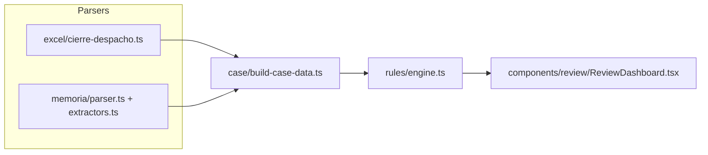
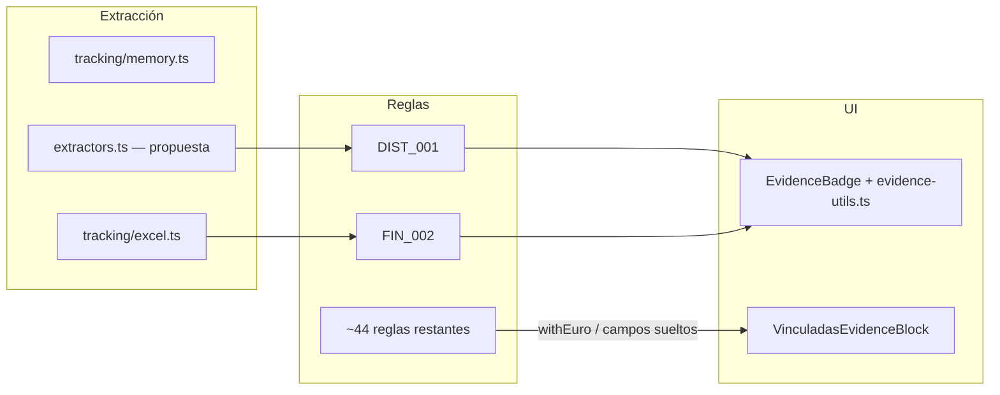

# Motor de Auditoría Híbrido: Control de Cuentas Anuales e Higiene Narrativa

**Informe técnico y mapa de ruta**  
**Fecha:** 18 de junio de 2026  
**Alcance:** Validación cruzada entre el libro de cierre contable (Excel `.xlsm`) y las memorias de sostenibilidad y financieras (Word `.DOC`/`.DOCX`)  
**Audiencia:** Equipo contable y técnico del despacho

---

## Relación con otros documentos del repositorio

| Documento | Rol |
|---|---|
| **Este informe** (`analisisFin18.md`) | Visión operativa del motor híbrido, reglas críticas de negocio, casos reales y plan de despliegue inmediato |
| [`testeomemoria.md`](testeomemoria.md) | Checklist exhaustivo de las ~46 reglas canónicas (parcialmente desactualizado respecto al código actual) |
| [`PROYECTO_RIM_SUMMARY.md`](PROYECTO_RIM_SUMMARY.md) | Arquitectura global del proyecto y visión de integración LLM |

---

## 1. Arquitectura general y flujo de información

El sistema procesa tres fuentes documentales de entrada para reconstruir el estado de un expediente y ejecutar el motor de reglas de forma **100 % determinista** (sin LLM en producción):

| Fuente | Ruta en `CaseData` | Descripción |
|---|---|---|
| Excel 2025 | `data.financials.libroCierre` / `data.excel` | Libro definitivo: sumas y saldos (`SYS_cliente`, `SYS_4_3_Digitos`), hoja fiscal (`calcis`), balance A3SOC, pendientes |
| Memoria 2025 | `data.memory` | Borrador redactado por el contable (apartados, tablas, cifras clave, propuesta de aplicación) |
| Memoria 2024 | `data.priorYear.memory` | Documento histórico oficial del ejercicio anterior (estructura y cifras de referencia) |



### Pipeline de procesamiento

1. **Parseo:** Los parsers normalizan Excel y Word a estructuras tipadas (`LibroCierre`, `MemoriaNormalizada`).
2. **Puente:** [`build-case-data.ts`](src/lib/case/build-case-data.ts) ensambla `CaseData` unificando memoria actual, memoria N-1 y libro de cierre.
3. **Motor:** [`engine.ts`](src/lib/rules/engine.ts) ejecuta ~46 reglas canónicas en [`rules/builtin/*.ts`](src/lib/rules/builtin/) más reglas custom JSON por expediente.
4. **Evaluación global:** [`global-evaluation.ts`](src/lib/rules/global-evaluation.ts) determina el estado de negocio (`ok` / `revisar` / `no_formulable`).
5. **UI:** [`ReviewDashboard.tsx`](src/components/review/ReviewDashboard.tsx) presenta críticos, advertencias y validaciones superadas con evidencias trazables.

### Capas de abstracción del motor

Las reglas se clasifican por `RuleType` ([`case-data.ts`](src/types/case-data.ts)) y se ordenan por prioridad de ejecución en el motor:

| Prioridad | Capa `RuleType` | Módulos representativos |
|---|---|---|
| 0 | `cross` | `cross.ts`, `cierre.ts` (CIERRE_004), `distribucion_resultados.ts`, `cuadre_valores_memoria.ts` |
| 1 | `fiscal` | `fiscal.ts`, `fiscal-advanced.ts`, `cierre.ts` (CIERRE_005) |
| 2 | `balance` | `balance.ts`, `cierre.ts` (CIERRE_001/002) |
| 3 | `pgc` | `pgc.ts` |
| 4 | `interannual` | `interannual.ts`, `anomaly.ts` |
| 5 | `formal` | `formal.ts`, `calidad_narrativa.ts` |
| 6 | `narrative` | `temporal.ts`, `narrative-advanced.ts` |

### Guardarraíles lógicos

#### Implementado hoy

**`CIERRE_001`** — Cuadre debe/haber de sumas y saldos ([`cierre.ts`](src/lib/rules/builtin/cierre.ts), L129–167):

- Suma la columna total Debe y la columna total Haber de `libro.sumasSaldos`.
- Tolerancia: ±0,05 €.
- Severidad: `critical`.
- Si falla, el mensaje de explicación advierte explícitamente que *«con descuadre en la partida doble, cualquier estado financiero derivado es inservible»*.

**Evaluación global** — Si existen errores críticos, `evaluateGlobalClosure()` marca el expediente como `no_formulable` y registra bloqueadores (errores críticos, pendientes en Excel, diferencias SYS vs A3SOC).

**Agrupación de reglas relacionadas** — [`rule-relations.ts`](src/lib/rules/helpers/rule-relations.ts) evita duplicar passes entre reglas del mismo grupo (p. ej. `CIERRE_001` + `CIERRE_002` + `BAL_001`).

#### Brecha documentada (no implementado aún)

El borrador original describe un guardarraíl adicional: **desactivar temporalmente las comparaciones cruzadas numéricas** cuando la partida doble no cuadra, para evitar una avalancha de falsos positivos en cascada. Este comportamiento **no existe en el código actual**: todas las reglas se ejecutan secuencialmente aunque `CIERRE_001` falle. Queda registrado como **próximo guardrail** en el plan del viernes 19/06 (sección 7).

---

## 2. Funcionalidades clave e implementación en extractores

Toda la lógica de extracción híbrida de la memoria reside en [`src/lib/parsers/memoria/extractors.ts`](src/lib/parsers/memoria/extractors.ts), orquestada por [`parser.ts`](src/lib/parsers/memoria/parser.ts) y consumida por [`build-case-data.ts`](src/lib/case/build-case-data.ts).

### A. Localización y extracción híbrida de tablas (Propuesta de resultados)

En lugar de depender de índices fijos de secciones o un orden posicional estricto — lo que generaría errores críticos al procesar memorias Pyme, Normales o Holdings con variaciones de plantilla — el extractor implementa un escaneo en **dos fases**:

**Fase 1 — Contexto prioritario**

- Busca una sección cuyo título encaje con `/0?3\s+Aplicaci[oó]n\s+de\s+resultados/i` o «Propuesta de distribución de beneficios».
- Filtra tablas del apartado `03` o con título coincidente (`perteneceApartadoPropuesta()`).
- Funciones: `detectarApartadoPropuesta()`, `PATRON_TITULO_SECCION_PROPUESTA`, `PATRON_PROPUESTA_DISTRIBUCION`.

**Fase 2 — Rastreo genérico / fallback**

- Si la sección no existe o carece de cuadros con datos, recorre secuencialmente todas las tablas del documento.
- Identifica la **huella digital contable** por presencia de celdas con `/BASE DE REPARTO/i` o `/DISTRIBUCI[OÓ]N/i` (`tablaTieneMarcadorReparto()`).
- Función orquestadora: `localizarTablasPropuesta()`.

**Extracción de filas reconocidas**

| Fila en Word | Campo en `PropuestaAplicacion` |
|---|---|
| Pérdidas y ganancias | `resultadoEjercicio`, `resultadoEjercicioAnterior` |
| A reserva de capitalización | `reservaIndisponible`, `reservaIndisponibleAnterior` |
| A reservas voluntarias | `reservasVoluntarias`, `reservasVoluntariasAnterior` |

Cada valor se emite como `TrackingValue<number>` vía `extraerCeldaPropuesta()` → `celdaMemoriaATracking()` ([`tracking/memory.ts`](src/lib/tracking/memory.ts)).

Export público: `extraerPropuestaAplicacion(texto, tablas, opts)`.

**Estado:** Implementado.  
**Pendiente:** Validar que `totalAplicacion` cuadre con el resultado del ejercicio (campo tipado pero sin regla dedicada).

### B. Limpieza estructural de datos de celda (`limpiarImporteCelda`)

Las tablas extraídas nativamente de archivos `.DOC`/`.DOCX` traen ruido de formato. El parser limpia estas anomalías (L555–562):

1. **Remoción de caracteres de control** ocultos de Word (incluido el delimitador de celda `\u0007` y rango `\u0000-\u001F`).
2. **Eliminación de ruido no numérico** dentro de la celda.
3. **Conversión del formato numérico europeo** a flotante JavaScript: `16.418,27` → `16418.27`.
4. Devuelve `null` si la celda está vacía o no contiene un dígito válido (las reglas downstream tratan `null` como ausencia de dato).

### C. Parser de higiene y continuidad narrativa

La integridad del texto corrido se audita en **dos capas complementarias**:

| Capa | Ubicación | Qué detecta |
|---|---|---|
| Extracción | `analizarFormal()` en extractors | Frases cortadas, placeholders, apartados repetidos, portada/firma |
| Reglas formales | [`formal.ts`](src/lib/rules/builtin/formal.ts) | `FORMAL_001` (frases cortadas), `FORMAL_002` (títulos duplicados) |
| Calidad narrativa | [`calidad_narrativa.ts`](src/lib/rules/builtin/calidad_narrativa.ts) | `FORMAL_003` (dos puntos huérfanos), `FORMAL_004` (párrafos consecutivos idénticos) |
| Semántica | [`narrative-advanced.ts`](src/lib/rules/builtin/narrative-advanced.ts) | `NARR_ADV_001` — afirmaciones genéricas vs magnitudes contables |
| Temporal | [`temporal.ts`](src/lib/rules/builtin/temporal.ts) | `TEMP_001` años obsoletos, `TEMP_002` boilerplate caducado |

**Dos puntos colgados (`FORMAL_003`):** Examina los finales de párrafo en cada bloque de `data.memory.sections`. Patrón: párrafo termina en `:\s*$` y el bloque posterior arranca vacío o salta abruptamente a una sección ajena — delata texto truncado tras borrar una tabla o un listado introductorio.

**Duplicación consecutiva (`FORMAL_004`):** Coincidencia exacta sobre cadenas largas de texto consecutivas en distintos apartados — caza errores de copia-pega durante el ensamblado final de la memoria.

---

## 3. Comportamiento en escenarios reales (casos de control)

El motor ha sido validado con dos tipologías de expedientes reales, demostrando capacidad para discriminar el contexto de negocio sin generar falsos positivos innecesarios.

### Caso comercial completo — FITOGAR, S.L.U.

| Aspecto | Comportamiento |
|---|---|
| Perfil | Memoria Normal (~26 apartados) |
| Detección | Localiza el Apartado 03 de aplicación de resultados |
| Reglas activadas | `DIST_001` (reserva capitalización CALCIS vs memoria) y `FIN_002` (cuadre de valores en propuesta) |
| Extracción | Fila «A reserva de capitalización» → `data.memory.propuestaAplicacion.reservaIndisponible` |
| Prueba de regresión | Al provocar un cambio manual en la memoria, la UI levanta alertas desglosando la diferencia exacta detectada en la cuenta 113 del balance contra el Word |

### Caso sociedad holding simplificada — PROFILTEK IBERGROUP, S.L.

| Aspecto | Comportamiento |
|---|---|
| Perfil | Holding abreviada (~11 apartados en lugar del estándar de 26) |
| Detección | `company-type.ts` identifica tipología reducida |
| Sin tabla de distribución | `FIN_002` ejecuta `skip` limpio (`reason: "sin_cifras_tabla"` o `tieneApartado: false`) — no genera alertas numéricas de reservas |
| Foco del motor | Discrepancias críticas del perfil holding: `CROSS_001` / `CIERRE_004` (operaciones con partes vinculadas, Apartado 09) y `CIERRE_005` (Impuesto sobre Sociedades corriente devengado en memoria vs cuenta 6300 en balanza) |

### Nota sobre fixtures E2E

[`scripts/e2e-examples.ts`](scripts/e2e-examples.ts) referencia archivos de PROFILTEK en `examples/`, pero el directorio actual solo contiene `M0106733.DOC`. La batería de aceptación automatizada **necesita actualización de fixtures** antes del despliegue del lunes (ver sección 7, Frente 3).

---

## 4. Qué hace y qué compara cada regla programada

### Tabla de equivalencia: nomenclatura borrador → código canónico

El equipo de negocio puede referirse a IDs simplificados (`SYS_001`, `VINC_001`, `FISC_001`). En el código, los IDs canónicos son distintos en algunos casos:

| ID código (canónico) | Alias borrador | Título en interfaz | Módulo | Qué compara exactamente |
|---|---|---|---|---|
| **`CIERRE_001`** | SYS_001 | Cuadre debe/haber de sumas y saldos | [`cierre.ts`](src/lib/rules/builtin/cierre.ts) | Σ columna Debe vs Σ columna Haber en `sumasSaldos`. Severidad `critical`. Marca `no_formulable` si falla. |
| **`FORMAL_003`** | FORMAL_003 | Texto truncado o incompleto | [`calidad_narrativa.ts`](src/lib/rules/builtin/calidad_narrativa.ts) | Regex `:\s*$` al cierre del párrafo sin continuación válida (párrafo, lista o tabla con datos). |
| **`FORMAL_004`** | — | Párrafo duplicado por copia-pega | [`calidad_narrativa.ts`](src/lib/rules/builtin/calidad_narrativa.ts) | Párrafos consecutivos idénticos en distintos apartados (longitud mínima configurable). |
| **`FIN_002`** | FIN_002 | Cuadre de valores en propuesta | [`cuadre_valores_memoria.ts`](src/lib/rules/builtin/cuadre_valores_memoria.ts) | **Check A:** Ejercicio actual (2025) vs cuentas 113 y 129 del Excel / CALCIS.<br>**Check B:** Columna ejercicio anterior en memoria N vs ejercicio actual en memoria 2024. |
| **`DIST_001`** | — | Reserva capitalización CALCIS vs memoria | [`distribucion_resultados.ts`](src/lib/rules/builtin/distribucion_resultados.ts) | Epígrafe CALCIS / cuenta 1146 vs `propuestaAplicacion.reservaIndisponible`. |
| **`CROSS_001`** | VINC_001 | Operaciones vinculadas no reflejadas | [`cross.ts`](src/lib/rules/builtin/cross.ts) | Suma del desglose narrativo (Apartado 09) vs subcuentas series 24x, 433, 403 y 552 en Excel. Helper: [`vinculadas.ts`](src/lib/rules/helpers/vinculadas.ts). |
| **`CIERRE_004`** | (complemento VINC) | Cruce fila a fila vinculadas | [`cierre.ts`](src/lib/rules/builtin/cierre.ts) | Desglose memoria vs Excel por prefijo de cuenta (mapeo `MAPEO_VINCULADAS`). |
| **`CIERRE_005`** | FISC_001 | Impuesto corriente: memoria vs 6300 | [`cierre.ts`](src/lib/rules/builtin/cierre.ts) | `keyData.impuestoCorriente` vs saldo cuenta 6300 (prefiere fuente A3SOC, fallback SYS). Tolerancia ±1 €. |

### Advertencia crítica de nomenclatura

**`FISCAL_001`** en [`fiscal.ts`](src/lib/rules/builtin/fiscal.ts) es una regla **distinta**: «Bases negativas sin uso» (coherencia entre BIN mencionadas y resultado positivo). **No** es el cruce impuesto corriente memoria vs 6300 — ese cruce es **`CIERRE_005`**.

### Detalle operativo por regla prioritaria

#### CIERRE_001 (alias SYS_001)

```
Entrada:  libro.sumasSaldos[]  (hoja SYS_cliente)
Cálculo:  totalDebe = Σ debe;  totalHaber = Σ haber
Criterio: |totalDebe - totalHaber| ≤ 0,05
Efecto:   critical → no_formulable
Evidencia: "SYS_cliente — total debe" / "SYS_cliente — total haber"
```

#### FIN_002

```
Entrada:  data.memory.propuestaAplicacion (TrackingValue)
          data.priorYear.memory.propuestaAplicacion
          getAccounts() → 113, 129
          data.excel.calcis.reservaCapitalizacion
Skip:     tipoEmpresa !== "normal" | sin apartado | sin cifras en tabla
Filas:    Pérdidas y ganancias | Reserva capitalización | Reservas voluntarias
Tolerancia: ±1 € por par comparado
```

#### CROSS_001 (alias VINC_001)

```
Entrada:  tablas apartado 09 + fullText memoria
          cuentas Excel prefijos 24x, 433, 403, 552
Trigger:  (saldo grupo > 10.000 € y memoria niega vinculadas)
       OR (descuadre > max(1.000 €, 5% del total Excel))
UI:       VinculadasEvidenceBlock (grid memoria + Excel por grupo)
```

#### CIERRE_005 (alias FISC_001 del borrador)

```
Entrada:  data.memory.keyData.impuestoCorriente
          saldoCierre(libro, ["6300"])
Skip:     ejercicios no alineados | datos ausentes
Criterio: |impuestoMemoria| vs |impuestoExcel| ≤ 1 €
Severidad: critical
```

---

## 5. Infraestructura de trazabilidad global (`TrackingValue`)

### Objetivo

Erradicar las «cajas negras» de la UI: cada cifra mostrada en una alerta debe indicar **de dónde salió** (documento, ubicación física en el archivo, valor raw de celda).

### Definición de tipos

[`src/types/tracking.ts`](src/types/tracking.ts):

```typescript
interface DataOrigen {
  documento: "excel" | "memoria_actual" | "memoria_anterior";
  ubicacion: string;   // ej. "Hoja: SYS_4_3_Digitos / Cuenta: 113 (Sumatorio)"
  detalleRaw?: string; // contenido original de celda antes de limpiar
}

interface TrackingValue<T = number> {
  valor: T;
  origen: DataOrigen;
}
```

Utilidades: `isTrackingValue()`, `unwrapValue()`, `trackingValue()`, `origenToEvidenceType()`.

### Estado actual de adopción



| Área | Estado | Detalle |
|---|---|---|
| Tipos `PropuestaAplicacion` | ✅ Completo | Todos los campos numéricos son `TrackingValue<number>` |
| Extracción memoria | ✅ Parcial | Propuesta de aplicación vía `celdaMemoriaATracking()` |
| Extracción Excel | ✅ Parcial | `sumByPrefixTracked()`, `mapCalcisReservaTracked()` en [`tracking/excel.ts`](src/lib/tracking/excel.ts) |
| Reglas con `fromTrackingValue()` | ⚠️ 2 de ~46 | Solo `DIST_001` y `FIN_002` |
| Puente evidencia | ✅ Listo | [`fromTrackingValue()`](src/lib/rules/helpers/evidence.ts) → `Evidence.origen` |
| UI badges | ✅ Preparada | [`EvidenceBadge.tsx`](src/components/review/EvidenceBadge.tsx) prioriza `origen.ubicacion` |
| UI vinculadas | ⚠️ Legacy | [`VinculadasEvidenceBlock`](src/components/review/EvidenceBlock.tsx) usa campos `sheet`/`row`/`column` sueltos |
| Informe HTML | ⚠️ Legacy | [`builder.ts`](src/lib/reports/builder.ts) no serializa `origen` |
| Persistencia | ✅ OK | `Evidence[]` con `origen` se guarda en BD sin pérdida |

### Formato objetivo de evidencias en UI

Strings dinámicos de procedencia que el contable debe poder leer en caliente:

```
Memoria ➔ [Apartado 03 / Pág. 3 / Fila: "A reservas voluntarias"] ➔ 70.548,26 €
Excel   ➔ [Hoja: SYS_4_3_Digitos / Cuenta: 113 (Sumatorio)]     ➔ 2.577.758,85 €
```

La infraestructura de renderizado (`evidence-utils.ts`, `EvidenceLocator.tsx`) ya soporta este formato cuando `origen` está presente; falta que **más reglas lo generen**.

---

## 6. Brechas conocidas (honestidad técnica)

| Brecha | Impacto | Estado |
|---|---|---|
| Guardrail en cascada (skip cross si CIERRE_001 falla) | Falsos positivos en cascada cuando el Excel no cuadra | No implementado |
| `FISCAL_001` ≠ cruce IS/6300 | Confusión de nomenclatura en documentación externa | Documentado en este informe |
| Solo 2 reglas emiten `fromTrackingValue` | UI muestra ubicación solo en distribución y cuadre propuesta | En progreso |
| `testeomemoria.md` desactualizado | Marca como «Falta» reglas ya implementadas (FORMAL_003, propuesta aplicación) | Pendiente revisión |
| E2E fixtures desalineados | `e2e-examples.ts` apunta a archivos inexistentes en `examples/` | Pendiente actualización |
| Validación `totalAplicacion` = resultado | Campo tipado sin regla de coherencia | Pendiente |
| `keyData.impuestoCorriente` sin TrackingValue | CIERRE_005 emite evidencia legacy | Pendiente migración |

---

## 7. Próximos pasos — Viernes 19/06 (despliegue lunes)

Para asegurar el despliegue del lunes, tres frentes técnicos con tareas concretas contra el código.

### Frente 1 — Inyectar `TrackingValue` en el core del motor

| Tarea | Archivos | Criterio de done |
|---|---|---|
| Migrar `CIERRE_004` a extracción trazada | `cierre.ts`, `tracking/excel.ts` | Evidencias con `origen.ubicacion` por prefijo de cuenta |
| Migrar `CIERRE_005` | `cierre.ts`, `extractors.ts` (impuesto corriente), `build-case-data.ts` | `keyData.impuestoCorriente` como `TrackingValue` |
| Migrar `CROSS_001` | `cross.ts`, `vinculadas.ts` | Evaluar unificación con `VinculadasEvidenceBlock` vía `origen` |
| Auditar `FIN_002` | `cuadre_valores_memoria.ts` | Todas las ramas de `evidence()` pasan por `fromTrackingValue` (comparaciones ya usan `unwrapValue`) |
| Activar `withTrackedValue` | `evidence.ts` | Helper existe pero no se usa en reglas legacy — conectar |

### Frente 2 — Homologar la UI de evidencias

| Tarea | Archivos | Criterio de done |
|---|---|---|
| Unificar formateo | `evidence-utils.ts` | Un solo `formatOrigen()` para badges, copy y localizador |
| Ubicación en comparativas | `ComparativeValues.tsx` | Mostrar `origen.ubicacion` cuando exista, no solo cifras |
| Distinguir memoria N vs N-1 | `EvidenceBadge.tsx` | Indicador visual para `memoria_anterior` |
| Copy enriquecido | `formatEvidenceForCopy` en evidence-utils | Incluir `origen.ubicacion` y `detalleRaw` |
| Evaluar `VinculadasEvidenceBlock` | `EvidenceBlock.tsx` | Consumir `origen` en lugar de duplicar lógica de localización |

### Frente 3 — Batería final de test de estrés contable

| Escenario | Acción | Resultado esperado |
|---|---|---|
| FITOGAR con error provocado en cuenta 113 | Ciclo completo «Revisar de nuevo» | Alerta `FIN_002` con evidencia trazada; panel no verde |
| FITOGAR con cierres ajustados | Reprocesar expediente limpio | Panel de validaciones superadas en verde |
| PROFILTEK holding sin propuesta | Reprocesar | `FIN_002` en skip; foco en `CROSS_001` y `CIERRE_005` |
| Excel con debe ≠ haber | Subir libro descuadrado | `CIERRE_001` critical → estado `no_formulable` |
| Regresión automatizada | Actualizar `scripts/e2e-examples.ts` | Fixtures alineados con `examples/`; assert de reglas críticas |

### Frente opcional (si hay tiempo)

Implementar guardrail de cascada en [`engine.ts`](src/lib/rules/engine.ts): si `CIERRE_001` falla, marcar `skip` en reglas `cross` numéricas dependientes (`FIN_002`, `DIST_001`, `CROSS_001`, `CIERRE_004`, `CIERRE_005`) para evitar ruido cuando la partida doble no es fiable.

---

## 8. Apéndice — Mapa de archivos clave

### Parsers y puente de datos

| Archivo | Responsabilidad |
|---|---|
| [`src/lib/parsers/memoria/extractors.ts`](src/lib/parsers/memoria/extractors.ts) | Extracción híbrida: cifras, apartados, propuesta aplicación, formal |
| [`src/lib/parsers/memoria/parser.ts`](src/lib/parsers/memoria/parser.ts) | Orquesta parseo DOC/RTF → memoria normalizada |
| [`src/lib/parsers/memoria/rtf.ts`](src/lib/parsers/memoria/rtf.ts) | Parseo RTF A3SOC |
| [`src/lib/parsers/excel/cierre-despacho.ts`](src/lib/parsers/excel/cierre-despacho.ts) | Libro `.xlsm`: sumas y saldos, A3SOC, CALCIS, pendientes |
| [`src/lib/case/build-case-data.ts`](src/lib/case/build-case-data.ts) | Ensambla `CaseData` (memoria + Excel + N-1) |

### Motor de reglas

| Archivo | Responsabilidad |
|---|---|
| [`src/lib/rules/engine.ts`](src/lib/rules/engine.ts) | Orquestación, prioridad, ejecución de reglas canónicas + custom |
| [`src/lib/rules/global-evaluation.ts`](src/lib/rules/global-evaluation.ts) | Estado global `ok` / `revisar` / `no_formulable` |
| [`src/lib/rules/builtin/cierre.ts`](src/lib/rules/builtin/cierre.ts) | CIERRE_001–005: debe/haber, balance, vinculadas fila a fila, IS/6300 |
| [`src/lib/rules/builtin/cross.ts`](src/lib/rules/builtin/cross.ts) | CROSS_001: operaciones vinculadas globales |
| [`src/lib/rules/builtin/cuadre_valores_memoria.ts`](src/lib/rules/builtin/cuadre_valores_memoria.ts) | FIN_002: cuadre propuesta aplicación |
| [`src/lib/rules/builtin/distribucion_resultados.ts`](src/lib/rules/builtin/distribucion_resultados.ts) | DIST_001: reserva capitalización |
| [`src/lib/rules/builtin/calidad_narrativa.ts`](src/lib/rules/builtin/calidad_narrativa.ts) | FORMAL_003/004: higiene narrativa |
| [`src/lib/rules/builtin/fiscal.ts`](src/lib/rules/builtin/fiscal.ts) | FISCAL_001: bases negativas (≠ cruce 6300) |
| [`src/lib/rules/helpers/vinculadas.ts`](src/lib/rules/helpers/vinculadas.ts) | Helper de diagnóstico y desglose vinculadas |
| [`src/lib/rules/helpers/evidence.ts`](src/lib/rules/helpers/evidence.ts) | `fromTrackingValue`, `withEuro`, `withMemoryLocator` |
| [`src/lib/rules/helpers/rule-relations.ts`](src/lib/rules/helpers/rule-relations.ts) | Agrupación de reglas relacionadas |

### Trazabilidad y tipos

| Archivo | Responsabilidad |
|---|---|
| [`src/types/tracking.ts`](src/types/tracking.ts) | `TrackingValue`, `DataOrigen`, utilidades |
| [`src/types/case-data.ts`](src/types/case-data.ts) | `CaseData`, `PropuestaAplicacion`, `RuleType` |
| [`src/lib/tracking/memory.ts`](src/lib/tracking/memory.ts) | `celdaMemoriaATracking()` |
| [`src/lib/tracking/excel.ts`](src/lib/tracking/excel.ts) | `sumByPrefixTracked()`, `mapCalcisReservaTracked()` |

### UI de revisión

| Archivo | Responsabilidad |
|---|---|
| [`src/components/review/ReviewDashboard.tsx`](src/components/review/ReviewDashboard.tsx) | Dashboard principal de validaciones |
| [`src/components/review/IssueCard.tsx`](src/components/review/IssueCard.tsx) | Tarjeta de error/advertencia por regla |
| [`src/components/review/EvidenceBadge.tsx`](src/components/review/EvidenceBadge.tsx) | Badge de evidencia con trazabilidad |
| [`src/components/review/EvidenceBlock.tsx`](src/components/review/EvidenceBlock.tsx) | Bloque especial CROSS_001 (vinculadas) |
| [`src/components/review/evidence-utils.ts`](src/components/review/evidence-utils.ts) | Formateo de origen y strings de procedencia |
| [`src/components/review/ComparativeValues.tsx`](src/components/review/ComparativeValues.tsx) | Comparativa Excel vs memoria (cifras) |

### Datos de configuración y pruebas

| Archivo | Responsabilidad |
|---|---|
| [`data/pgc/apartados-memoria.json`](data/pgc/apartados-memoria.json) | Catálogo de apartados Normal/Abreviada |
| [`scripts/e2e-examples.ts`](scripts/e2e-examples.ts) | Pruebas de aceptación con expedientes reales |
| [`testeomemoria.md`](testeomemoria.md) | Checklist de auditoría punto a punto |

---

*Documento generado el 18/06/2026 como cierre de jornada técnica. Próxima revisión prevista tras la jornada del 19/06 (implementación de TrackingValue, UI homogénea y batería de estrés).*
