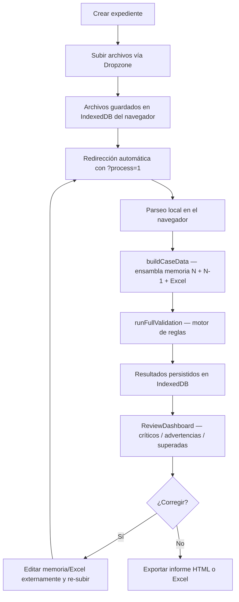

# Contexto técnico — Módulo de Memorias Anuales

> Documentación maestra para sincronización de LLM sobre el estado y funcionamiento del proyecto **Memorias**.  
> Generado: 23 de junio de 2026 · Basado en análisis estático de `src/`, `prisma/`, `data/`, `scripts/`.

---

## Tabla de contenidos

1. [Visión general y objetivo](#1-visión-general-y-objetivo)
2. [Arquitectura y stack](#2-arquitectura-y-stack)
3. [Lógica de comparación core](#3-lógica-de-comparación-core)
4. [Estado actual y roadmap](#4-estado-actual-y-roadmap)
5. [Modelos de datos](#5-modelos-de-datos)
6. [Apéndices](#6-apéndices)

---

## 1. Visión general y objetivo

### 1.1 Qué hace el producto

**Memorias** es una aplicación web para despachos contables que automatiza la **revisión, validación y auditoría** de cierres contables y memorias anuales antes de su formulación y depósito (plazo habitual: **30 de junio**).

El usuario sube, por cada cliente:

| Documento | Formato | Rol |
|---|---|---|
| Libro de cierre del despacho | `.xlsm` (principalmente) | Fuente de verdad numérica: sumas y saldos, balance comparativo, P&G, hoja fiscal CALCIS |
| Memoria del ejercicio actual | `.doc` / `.docx` / `.pdf` | Borrador redactado por el contable (apartados, tablas, narrativa) |
| Memoria del ejercicio anterior | Opcional, mismos formatos | Referencia histórica para comparación interanual |

El sistema **parsea** los archivos, **ensambla** un modelo unificado (`CaseData`), ejecuta un **motor de reglas determinista** (~47 reglas canónicas + reglas custom JSON) y presenta un **dashboard de incidencias** con evidencia trazable (hoja/fila Excel, apartado/página memoria).

**Volumen previsto:** 200–300 expedientes por temporada de cierre.

### 1.2 Problema que resuelve para Rentas / el despacho

| Dolor operativo | Cómo lo aborda el sistema |
|---|---|
| Arrastre de texto y años del ejercicio anterior sin actualizar | Reglas temporales (`TEMP_001`–`004`) y comparación interanual de estructura |
| Descuadres memoria ↔ Excel (vinculadas, IS, propuesta de resultados) | Cruces numéricos con tolerancias (`CROSS_*`, `CIERRE_004/005`, `FIN_002`, `DIST_001`) |
| Errores estructurales (apartados faltantes, tablas vacías, texto truncado) | Reglas formales y de cierre (`CIERRE_006/007`, `FORMAL_*`) |
| Revisión manual repetitiva de 200+ expedientes | Score 0–100, estado global (`ok` / `revisar` / `no_formulable`), filtrado por severidad y apartado |
| Falta de trazabilidad («¿de dónde sale esta cifra?») | Infraestructura `TrackingValue` + evidencias con `origen.ubicacion` (parcialmente adoptada) |

**No hay integración LLM en producción.** Todo el motor actual es código TypeScript puro (regex, heurísticas, comparaciones numéricas). La arquitectura está preparada para incorporar reglas semánticas asíncronas en el futuro.

### 1.3 Flujo operativo del usuario final



**Pasos detallados:**

1. **Crear expediente** (`/expedientes/new`): el usuario arrastra el `.xlsm` y una o dos memorias. Cliente y ejercicio se autodetectan al procesar (no se piden en el formulario).
2. **Almacenamiento local**: los blobs se guardan en **IndexedDB** (`expediente-store.ts`). Los archivos no salen del navegador en el flujo principal.
3. **Procesamiento automático**: tras la subida, redirige a `/expedientes/[id]?process=1` que dispara `runExpedienteProcess()` → `processExpedienteLocal()`.
4. **Revisión**: el `ReviewDashboard` agrupa incidencias por severidad y, si hay apartados parseados, por sección de la memoria (`ApartadoReviewSection`).
5. **Reglas personalizadas** (opcional): `/expedientes/[id]/rules` — JSON `{field, operator, compareTo, tolerance, message}`.
6. **Exportación**: informe HTML autocontenido o filas Excel (`reports/builder.ts`, `reports/download.ts`).

---

## 2. Arquitectura y stack

### 2.1 Stack tecnológico

| Capa | Tecnología | Notas |
|---|---|---|
| Framework | **Next.js 15** (App Router) + **React 19** + **TypeScript 5.8** | Monolito: UI + API routes |
| Estilos | **Tailwind CSS 4** | |
| Persistencia principal (UI) | **IndexedDB** vía `src/lib/storage/` | Expedientes, blobs, validaciones — 100 % local en navegador |
| Persistencia alternativa (legacy) | **Prisma 6 + SQLite** (`prisma/dev.db`) | API server-side; coexiste pero el flujo UI actual no la usa |
| Excel | **SheetJS (`xlsx` 0.18.5)** | Solo lectura; whitelist de hojas; sin ejecutar macros |
| Word .docx | **mammoth** | Texto plano |
| Word .doc binario | **word-extractor** | Cuerpo + encabezados (portada en header) |
| .DOC con contenido RTF (A3SOC) | **Parser RTF propio** (`parsers/memoria/rtf.ts`) | Sin dependencias externas |
| PDF | **pdf-parse** | Texto + páginas reales |
| Validación | Motor de reglas propio TS | ~47 reglas en 17 módulos `builtin/` |
| IA / LLM | **No implementado** | Sin SDK de IA, sin prompts en `src/` |

Dependencias instaladas sin uso real en producción: `zod`, `@react-pdf/renderer`.

### 2.2 Estructura de directorios relevante

```
memorias/
├── data/pgc/                          # Catálogos normativos estáticos (JSON)
│   ├── apartados-memoria.json         # Apartados Normal/Abreviada + variantes de título
│   ├── cuentas.json                   # Catálogo PGC
│   └── reglas-fiscales.json           # Keywords (vinculadas, riesgos, BINs, continuidad…)
├── examples/                          # Fixtures reales del despacho para pruebas
├── prisma/schema.prisma               # Modelo server-side (Expediente, Archivo, ValidacionResultado…)
├── scripts/e2e-examples.ts            # Prueba de aceptación (fixtures desactualizados)
└── src/
    ├── app/
    │   ├── page.tsx                   # Listado de expedientes (IndexedDB)
    │   ├── expedientes/new/           # Alta + subida
    │   ├── expedientes/[id]/          # Dashboard de revisión
    │   ├── expedientes/[id]/rules/    # CRUD reglas custom
    │   └── api/
    │       ├── process/route.ts       # Pipeline stateless (multipart, maxDuration 300s)
    │       ├── expedientes/           # CRUD server-side (legacy)
    │       └── rules/                 # CRUD reglas custom server-side
    ├── components/
    │   ├── review/                    # ReviewDashboard, IssueCard, EvidenceBadge, InterannualDiff…
    │   └── upload/Dropzone.tsx
    ├── lib/
    │   ├── parsers/
    │   │   ├── excel/                 # cierre-despacho.ts, detector.ts, sheet-config.ts
    │   │   └── memoria/               # parser.ts, rtf.ts, extractors.ts
    │   ├── case/build-case-data.ts    # Ensambla CaseData unificado
    │   ├── classifier/                # Heurística tipo empresa (holding/comercial/industrial)
    │   ├── process/
    │   │   ├── expediente-core.ts     # PIPELINE COMPARTIDO (parse → validate)
    │   │   ├── client-process.ts      # Wrapper navegador
    │   │   ├── expediente.ts          # Wrapper Prisma/server (legacy)
    │   │   └── resolve-ejercicio.ts   # Asignación memoria actual vs anterior
    │   ├── rules/
    │   │   ├── engine.ts              # Orquestador + guardarraíl cascada CIERRE_001
    │   │   ├── builtin/               # 17 ficheros de reglas
    │   │   ├── custom/evaluator.ts    # Reglas JSON del usuario
    │   │   ├── scoring.ts             # Score 0-100
    │   │   ├── global-evaluation.ts   # ok / revisar / no_formulable
    │   │   └── helpers/               # coherencia-comparativa, text-normalize, evidence, vinculadas…
    │   ├── storage/                   # IndexedDB (expediente-store, indexed-db)
    │   ├── tracking/                  # TrackingValue para trazabilidad
    │   └── reports/                   # builder.ts, download.ts
    └── types/
        ├── domain.ts                  # Modelos de dominio en español
        ├── case-data.ts               # CaseData unificado (inglés, consumido por reglas)
        └── tracking.ts                # TrackingValue, DataOrigen
```

### 2.3 Patrones arquitectónicos

| Patrón | Implementación |
|---|---|
| **Pipeline de procesamiento** | `parseSingleArchivo` → `finalizeExpedienteCore` → `buildCaseData` → `runFullValidation` |
| **Reglas como plugins** | `RuleDefinition { execute, explanation, evidence }` en `rules/types.ts` |
| **Separación detección / explicación / evidencia** | Cada regla produce `RuleOutcome` → se convierte en `RuleResult` con texto senior y chips de evidencia |
| **Modelo unificado** | `CaseData` fusiona financials + memory + priorYear; serializable a JSON |
| **Dual persistencia** | IndexedDB (activo en UI) + Prisma/SQLite (API legacy, scripts) |
| **Clasificación en dos fases** | Extensión al subir (`classify-extension`) → magic bytes al procesar (`classify-content`) |
| **Guardarraíl anti-cascada** | Si `CIERRE_001` (partida doble) falla, se omiten reglas cruzadas dependientes (`engine.ts`) |
| **Agrupación de passes** | `rule-relations.ts` + `parse-issue.ts` ocultan OK redundantes cuando hay fallo del mismo tema |

### 2.4 Flujo de datos end-to-end

```
Archivos (blob)
    ↓ classifyUploadedFile (magic bytes)
    ↓ parseExcel / parseMemoria
    ↓ MemoriaNormalizada + LibroCierre + BalanceNormalizado
    ↓ assignMemorias(memorias, ejercicio) + priorYear
    ↓ buildCaseData → CaseData
    ↓ runFullValidation → RuleResult[] + CaseScore + GlobalEvaluation
    ↓ StoredValidacion[] + caseDataSnapshot (JSON en IndexedDB)
    ↓ ReviewDashboard (ValidacionView[])
```

---

## 3. Lógica de comparación core

Esta sección describe cómo el sistema compara la memoria del ejercicio **N-1** (ej. 2024) con la del ejercicio **N** (ej. 2025), y cómo distingue **errores estructurales** de **cambios normales de curso lectivo**.

### 3.1 Fuentes de la comparación interanual

El bloque `CaseData.priorYear` se alimenta por **tres vías** (en orden de preferencia):

| Fuente | Condición | Qué aporta |
|---|---|---|
| Segunda memoria en el mismo expediente | `assignMemorias()` detecta dos memorias con ejercicios N y N-1 | `priorYear.memory` completa |
| Columnas comparativas del Excel | `libroCierre.ejercicioAnterior` del `.xlsm` | `priorYear.balance` (epígrafes año anterior) |
| Expediente vinculado | `expediente.ejercicioAnteriorId` en IndexedDB | Re-parsea archivos del expediente anterior |

Función clave: `resolve-ejercicio.ts` → `assignMemorias(memorias, ejercicio)`.

### 3.2 Taxonomía: error estructural vs cambio normal

El sistema codifica esta distinción en **tres capas** de lógica:

#### Capa A — Normalización que ignora cambios esperables

`normalizarTextoComparacionInteranual()` (`rules/helpers/text-normalize.ts`) elimina antes de comparar textos:

- Años (`2024`, `2025`…)
- Fechas (`31/12/2024`, `15 de marzo de 2025`)
- Importes y moneda (`16.418,27 €`)
- La frase fija «a 31 de diciembre»

**Principio:** dos memorias consecutivas *deben* diferir en cifras y ejercicios; eso **no es un error**.

Los apartados se emparejan por **slug de título** (`apartadoSlug()`), no por número, para tolerar renumeraciones menores.

#### Capa B — Errores estructurales (integridad del documento)

| ID | Severidad | Qué detecta | Por qué es estructural |
|---|---|---|---|
| **INTER_008** | `critical` | Apartados presentes en N-1 ausentes en N (`detectarApartadosOmitidos`) | La estructura del documento se rompió; no es una variación de cifras |
| **INTER_010** | `error` | Columna «importe N-1» en memoria N ≠ cifra publicada en memoria N-1 (`detectarDescuadresComparativa`) | La columna comparativa debe ser fiel al histórico; un cambio aquí es error de edición |
| **CIERRE_006** | `warning`/`critical` | Apartados 01–11 obligatorios de memoria abreviada ausentes vs catálogo PGC | Incumplimiento normativo estructural |
| **CIERRE_007** | `warning` | Tablas vacías o anunciadas sin contenido | Estructura anunciada pero sin datos |
| **FORMAL_001/002/003/004** | `warning` | Frases cortadas, títulos duplicados, dos puntos huérfanos, párrafos idénticos | Corrupción del documento |
| **TEMP_001** | `critical` | Años obsoletos en contexto de ejercicio (arrastre de párrafos) | Texto del año anterior no actualizado |

#### Capa C — Cambios de curso lectivo (advertencias, no bloqueantes)

| ID | Severidad | Qué detecta | Por qué es cambio normal |
|---|---|---|---|
| **INTER_002** | `warning` | Cambio holding ↔ operativa (`clasificarEmpresa`) | Transformación societaria legítima; pide explicación narrativa |
| **INTER_003** | `warning` | Desaparición de secciones clave (vinculadas, fiscal) por keywords | Puede ser cambio de tipo de memoria; requiere verificación |
| **INTER_004** | `warning` | Cuentas nuevas con saldo > 5.000 € | Nuevas operaciones o reclasificaciones esperables |
| **ANOM_003** | `warning` | Saldos atípicos para el tipo de empresa | Variación de actividad, no error de formato |
| Variación de importes del ejercicio **N** | *(no regla dedicada aún)* | Cambios en columna del año actual | Esperado en cierre ordinario |

**Regla de oro de INTER_010** (codificada en la explicación de la regla):

> Es normal que varien los importes del ejercicio actual (N); lo crítico es que la **columna comparativa de N-1** reproduzca fielmente lo ya publicado en la memoria de N-1.

### 3.3 Algoritmo de coherencia comparativa (INTER_010)

Implementado en `rules/helpers/coherencia-comparativa.ts`:

```
ENTRADA:
  tablasActual: TablaMemoria[]     # memoria N
  tablasAnterior: TablaMemoria[]   # memoria N-1
  ejercicioActual: N
  ejercicioAnterior: N-1
  tolerancia: 0.5% (default)

PASO 1 — Construir mapa de referencia desde memoria N-1:
  Para cada tabla en tablasAnterior:
    colIdx = encontrarColumnaEjercicio(cabecera, N-1)   # busca "2024" en cabecera
    Para cada fila de datos (no cabecera anual):
      clave = apartado|etiquetaFilaNormalizada
      mapa[clave] = { valor, filaEtiqueta, apartado, pagina }

PASO 2 — Comparar columna N-1 en memoria N:
  Para cada tabla en tablasActual:
    colIdx = encontrarColumnaEjercicio(cabecera, N-1)
    Para cada fila:
      valorComparativa = parseImporte(fila[colIdx])
      ref = mapa[clave]
      Si ref existe Y |valorComparativa - ref.valor| > tolerancia:
        → DESCUADRE (error estructural)

SALIDA: DescuadreComparativa[]
  { apartado, filaEtiqueta, valorMemoriaAnterior, valorColumnaComparativa, pagina }
```

**Emparejamiento de filas:** la etiqueta de la primera celda se normaliza (`normalizarEtiquetaFila`) eliminando prefijos «importe 20XX» y unificando acentos/minúsculas.

**Tolerancia numérica:** `compareWithTolerance(valor1, valor2, 0.005)` — 0,5 % relativo.

### 3.4 Algoritmo de estructura espejo (INTER_008)

```
ENTRADA: sectionsActual[], sectionsAnterior[]

Para cada apartado en sectionsAnterior:
  slug = apartadoSlug(section)   # título normalizado sin numeración
  Si slug NO está en sectionsActual:
    → OMITIDO (critical)

SALIDA: ApartadoOmitido[] { slug, nombre, numero }
```

Diferencia con **CIERRE_006**: INTER_008 compara contra lo que **realmente tenía el cliente el año anterior**; CIERRE_006 compara contra el **catálogo normativo** de apartados abreviados 01–11.

### 3.5 Algoritmo de variación de texto (helper, sin regla activa)

`detectarVariacionesTextoApartados()` existe en `text-normalize.ts` pero **no está conectada a ninguna regla** todavía. Su lógica:

1. Empareja apartados por slug entre N y N-1.
2. Normaliza con `normalizarTextoComparacionInteranual()` (ignora años, fechas, cifras).
3. Si el texto normalizado difiere:
   - **Reducción > 50 %** de longitud → cambio significativo (`motivo: "reduccion"`).
   - **Variación > 10 %** de longitud → cambio significativo (`motivo: "variacion"`).
4. Si el texto normalizado es **idéntico** tras quitar cifras/años → **no alerta** (arrastre puro del párrafo, posible `TEMP_001` pero no variación estructural).

### 3.6 Algoritmo de tablas degradadas (helper, sin regla activa)

`detectarTablasDegradadasInteranual()` en `tablas-interanual.ts`:

- Empareja tablas por `apartado|tituloSlug`.
- Si en N-1 había ≥ 2 celdas con datos y en N la tabla está vacía o perdió > 50 % de celdas → degradada.
- **Pendiente de regla** que consuma este helper.

### 3.7 Comparación memoria ↔ Excel (no interanual, pero crítica)

Además de N vs N-1, el motor cruza memoria N con Excel N:

| Regla | Comparación |
|---|---|
| `CROSS_001` | Total vinculadas memoria (apartado 09) vs cuentas 24x/433/403/552 |
| `CIERRE_004` | Desglose fila a fila vinculadas memoria vs Excel |
| `CIERRE_005` | `keyData.impuestoCorriente` vs cuenta 6300 (±1 €) |
| `FIN_002` | Propuesta aplicación resultados: memoria vs cuentas 113/129/CALCIS + columna N-1 vs memoria N-1 |
| `DIST_001` | Reserva capitalización CALCIS vs memoria apartado 03 |
| `CIERRE_001/002` | Partida doble y activo = PN + pasivo |

### 3.8 Guardarraíl de fiabilidad

Si `CIERRE_001` (debe = haber) falla con severidad `critical` o `error`, el motor **omite** automáticamente:

`FIN_002`, `DIST_001`, `CROSS_001`, `CIERRE_004`, `CIERRE_005`

con `status: "skip"` y tag `guardrail_skip`. Evita falsos positivos cuando los saldos subyacentes no son fiables.

### 3.9 Presentación en UI de resultados interanuales

`parse-issue.ts` define qué reglas INTER_* se muestran dónde:

| Comportamiento | Reglas |
|---|---|
| Solo en bloque «Comparación interanual» (estadísticas) | `INTER_002`, `INTER_003`, `INTER_004` |
| En tarjetas de auditoría principal | `INTER_008`, `INTER_010` |
| Componente `InterannualDiff` | Todas las `INTER_*` |
| Diff de texto lado a lado | `InterannualTextDiff` (cuando evidencia tiene `diffPrior` / `diffCurrent`) |

---

## 4. Estado actual y roadmap

### 4.1 Funcionalidades operativas

| Área | Estado | Detalle |
|---|---|---|
| Subida y almacenamiento local | ✅ Operativo | IndexedDB, blobs en navegador |
| Parseo memoria RTF/DOC/DOCX/PDF | ✅ Operativo | Detección por magic bytes; RTF A3SOC probado |
| Parseo libro cierre `.xlsm` | ✅ Operativo | Whitelist de hojas ministeriales |
| Motor de ~47 reglas canónicas | ✅ Operativo | Ver catálogo en apéndice 6.1 |
| Reglas custom JSON | ✅ Operativo | Por expediente o globales |
| Score y estado global | ✅ Operativo | `ok` / `revisar` / `no_formulable` |
| Dashboard de revisión por apartado | ✅ Operativo | `ApartadoReviewSection` + `IssueCard` |
| Comparación interanual estructural | ✅ Operativo | `INTER_008`, `INTER_010` |
| Cruces memoria ↔ Excel | ✅ Operativo | Vinculadas, IS, propuesta, CALCIS |
| Guardarraíl cascada CIERRE_001 | ✅ Implementado | `engine.ts` (actualizado respecto a `analisisFin18.md`) |
| Exportación HTML / Excel | ✅ Operativo | |
| Trazabilidad `TrackingValue` | ⚠️ Parcial | Solo `DIST_001` y `FIN_002` emiten `origen` completo |
| API stateless `/api/process` | ✅ Disponible | Alternativa server-side sin IndexedDB |

### 4.2 En progreso / helpers sin regla

| Elemento | Ubicación | Estado |
|---|---|---|
| `detectarVariacionesTextoApartados` | `text-normalize.ts` | Helper listo, **sin regla INTER_*** |
| `detectarTablasDegradadasInteranual` | `tablas-interanual.ts` | Helper listo, **sin regla** |
| Migración `TrackingValue` a CIERRE_004/005, CROSS_001 | Plan en `analisisFin18.md` §7 | En progreso |
| UI homogénea de evidencias con `origen` | `EvidenceBadge`, `ComparativeValues` | Parcial |

### 4.3 Pendiente / deuda técnica

| Ítem | Impacto | Prioridad |
|---|---|---|
| `INTER_001` (variación numérica >30 % activo/resultado) | Documentado en `testeomemoria.md` pero **no existe en código** | Media |
| `ANOM_001/002` (variaciones >50 % sin explicación) | Eliminadas; solo queda `ANOM_003` | Baja |
| Reglas muertas `CIERRE_003/008` (A3SOC, PENDIENTES) | `a3soc` y `notas` hardcodeados a `[]` — nunca fallan | Media |
| `scripts/e2e-examples.ts` desactualizado | Fixtures no coinciden con `examples/` | Alta |
| Sin tests unitarios de parsers/reglas | Riesgo al escalar a 300 expedientes | Alta |
| Parseo tablas en `.docx`/PDF degradado | `mammoth`/`pdf-parse` pierden estructura de celdas | Media |
| Cola de trabajos / procesamiento batch | Todo es síncrono en el navegador, expediente a expediente | Alta (escala) |
| Integración LLM para semántica narrativa | Arquitectura preparada (`RuleDefinition` extensible) | Roadmap futuro |
| Validación `totalAplicacion` = resultado ejercicio | Campo tipado sin regla | Baja |
| Nomenclatura dual español/inglés en tipos | `severidad`/`severity`, `memoria`/`memory` | Deuda de mantenimiento |

### 4.4 Roadmap documentado (de `analisisFin18.md`)

**Frente 1 — TrackingValue en el core:** migrar `CIERRE_004`, `CIERRE_005`, `CROSS_001` a evidencias con `origen.ubicacion`.

**Frente 2 — UI de evidencias:** unificar `formatOrigen()`, distinguir memoria N vs N-1 en badges, enriquecer copy.

**Frente 3 — Batería de estrés:** actualizar E2E con FITOGAR y PROFILTEK; asserts de reglas críticas.

**Frente opcional:** reglas interanuales para variación de texto (`detectarVariacionesTextoApartados`) y tablas degradadas.

---

## 5. Modelos de datos

### 5.1 Persistencia en IndexedDB (flujo activo)

#### `StoredExpediente`

```typescript
{
  id: string;                    // UUID
  cliente: string;               // Autodetectado del Excel/memoria
  ejercicio: number;               // Autodetectado
  ejercicioAnteriorId?: string;  // FK opcional a otro expediente
  tipoEmpresa?: string;          // holding | comercial | industrial | desconocido
  estado: string;                // borrador | procesando | revisado
  scoreSnapshot?: string;        // JSON de CaseScore
  caseDataSnapshot?: string;     // JSON completo de CaseData post-proceso
  createdAt: string;
  updatedAt: string;
}
```

#### `StoredArchivo`

```typescript
{
  id: string;
  expedienteId: string;
  tipo: string;          // excel_cierre | memoria_word | memoria_pdf | excel_anterior…
  nombre: string;
  metadata: string;      // JSON: { ejercicio, cliente, formato, parseError? }
  createdAt: string;
}
// El blob binario se almacena en store separado "archivoBlobs"
```

#### `StoredValidacion` (discrepancia / resultado de regla)

```typescript
{
  id: string;
  expedienteId: string;
  ruleId: string;           // ej. "INTER_010", "CROSS_001"
  categoria: string;        // cross | balance | fiscal | formal | interannual | narrative | custom…
  severidad: string;        // critical | warning | pass
  mensaje: string;          // Texto principal (explanation)
  title?: string;           // Título legible de la regla
  explanation?: string;     // Texto estructurado (qué / impacto / acción)
  normativa?: string;
  referencia?: string;
  evidencia: string;        // JSON — ver esquema abajo
  sugerencia?: string;
  createdAt: string;
}
```

#### Esquema JSON de `evidencia`

**Formato simple** (reglas legacy):

```json
[
  {
    "type": "excel" | "memory",
    "reference": "Cuenta 6300",
    "value": 45230.15,
    "formattedValue": "45.230,15 €",
    "text": "fragmento opcional",
    "importance": "high" | "medium" | "low",
    "sheet": "SYS_4_3_Digitos",
    "row": 142,
    "section": "09",
    "sectionTitle": "Operaciones con partes vinculadas",
    "diffPrior": "texto ejercicio anterior",
    "diffCurrent": "texto ejercicio actual",
    "origen": {
      "documento": "excel" | "memoria_actual" | "memoria_anterior",
      "ubicacion": "Hoja: calcis / Fila: 87",
      "detalleRaw": "16.418,27"
    }
  }
]
```

**Formato envuelto** (reglas con diagnosis/tags/skip):

```json
{
  "items": [ /* Evidence[] como arriba */ ],
  "diagnosis": "3 cifra(s) comparativa(s) no coinciden…",
  "tags": ["guardrail_skip"],
  "status": "skip",
  "skipReason": "balance_descuadrado_fiabilidad_nula"
}
```

### 5.2 Modelo unificado `CaseData` (post-parseo, pre-reglas)

```typescript
CaseData {
  expedienteId: string;
  metadata: { cliente, ejercicio, tipoEmpresa };
  financials: {
    accounts: CuentaNormalizada[];
    balance?: BalanceNormalizado;
    sumasSaldos?: CuentaNormalizada[];
    libroCierre?: LibroCierre;
  };
  excel?: { calcis?: CalcisExcel };
  memory?: {
    sections: ApartadoMemoria[];      // Apartados 01-11 o narrativos
    tables: TablaMemoria[];
    statements: MemoryStatement[];      // Afirmaciones tipadas (vinculadas, riesgos…)
    figures: CifrasMemoria;
    keyData: DatosClaveMemoria;         // NIF, ejercicio, impuesto corriente, empleo…
    years: AnioMencionado[];
    formal: FormalMemoria;
    fullText: string;
    metadata: { paginas, archivo, formato };
    propuestaAplicacion?: PropuestaAplicacion;
    vinculadas?: VinculadasMemoria;
  };
  priorYear?: {
    ejercicio: number;
    financials: { accounts, balance? };
    memory?: {
      sections, figures, fullText, keyData,
      tables?, propuestaAplicacion?, vinculadas?
    };
  };
}
```

### 5.3 Estructuras de apartados y tablas durante el procesamiento

#### `ApartadoMemoria`

```typescript
{
  id: string;           // slug derivado del título
  titulo: string;
  contenido: string;    // Texto completo del apartado
  obligatorio: boolean;
  numero?: number;      // 1-11 si usa numeración canónica
}
```

Extraído por `extraerApartados()` en `extractors.ts` con patrones:
- Canónico: `"NN Título"` (01–11)
- Legacy: romanos, `1.`, MAYÚSCULAS

#### `TablaMemoria`

```typescript
{
  apartado?: string;    // "04", "09"…
  titulo: string;       // Párrafo precedente
  cabecera: string[];   // Primera fila
  filas: string[][];    // Filas de datos
  vacia: boolean;
  linea: number;
  pagina?: number;
}
```

Las celdas usan separador ` | ` (normalizado desde RTF tabs o word-extractor).

#### `DescuadreComparativa` (discrepancia interanual numérica)

```typescript
{
  apartado?: string;
  filaEtiqueta: string;
  ejercicioReferencia: number;
  valorMemoriaAnterior: number;      // Publicado en memoria N-1
  valorColumnaComparativa: number;   // Columna N-1 en memoria N
  tablaTitulo?: string;
  pagina?: number;
}
```

### 5.4 Persistencia server-side (Prisma, legacy)

```prisma
Expediente { id, cliente, ejercicio, ejercicioAnteriorId, tipoEmpresa, scoreSnapshot, estado }
Archivo { id, expedienteId, tipo, nombre, ruta, metadata }
DatosExtraidos { id, expedienteId, fuente, payload }  // excel | memoria | case (JSON string)
ValidacionResultado { id, expedienteId, ruleId, categoria, severidad, mensaje, evidencia, … }
ReglaCustom { id, nombre, expresion, severidad, activa, expedienteId? }
```

En el flujo Prisma, `DatosExtraidos.payload` guarda el JSON completo del parseo (incluido `textoCompleto`), lo que genera payloads grandes.

### 5.5 Catálogos normativos (`data/pgc/`)

- **`apartados-memoria.json`**: apartados Normal (14) y Abreviada (11 numerados) con variantes de título para matching flexible.
- **`cuentas.json`**: catálogo PGC para normalización de cuentas.
- **`reglas-fiscales.json`**: keywords para `extraerStatements()` (vinculadas, riesgos, BINs, continuidad…).

### 5.6 Resultado de regla → UI

La cadena de transformación:

```
RuleDefinition.execute(CaseData) → RuleOutcome
  → runRuleDefinition() → RuleResult { severity, explanation, evidence[], diagnosis, tags }
  → ProcessValidacion { evidencia: JSON.stringify(...) }
  → StoredValidacion (IndexedDB)
  → ValidacionView (parseValidaciones en expediente-client)
  → IssueCard / ApartadoReviewSection (enrichIssue en parse-issue.ts)
```

---

## 6. Apéndices

### 6.1 Catálogo completo de reglas canónicas (~47)

| ID | Módulo | Tipo | Severidad default | Resumen |
|---|---|---|---|---|
| TEMP_001 | temporal | narrative | critical | Años obsoletos en texto |
| TEMP_002 | temporal | narrative | warning | Boilerplate caducado (pandemia, alarma) |
| TEMP_003 | temporal | narrative | warning | Ejercicio memoria ≠ ejercicio expediente |
| TEMP_004 | temporal | narrative | warning | Fecha de formulación incoherente |
| CIERRE_001 | cierre | balance | critical | Debe = Haber (sumas y saldos) |
| CIERRE_002 | cierre | balance | critical | Activo = PN + Pasivo |
| CIERRE_003 | cierre | cross | warning | SYS vs A3SOC (**muerta**: a3soc=[]) |
| CIERRE_004 | cierre | cross | error | Vinculadas fila a fila memoria vs Excel |
| CIERRE_005 | cierre | fiscal | critical | Impuesto corriente memoria vs 6300 |
| CIERRE_006 | cierre | formal | warning | Apartados obligatorios 01-11 abreviada |
| CIERRE_007 | cierre | formal | warning | Tablas vacías o anunciadas sin contenido |
| CIERRE_008 | cierre | formal | warning | Pendientes despacho (**muerta**: notas=[]) |
| CIERRE_009 | cierre | formal | warning | Identificación sociedad incompleta |
| CIERRE_010 | cierre | formal | warning | Coherencia ejercicio memoria vs libro |
| CLOSURE_001 | closure | formal | warning | Pendientes en hojas Excel |
| CONSISTENCIA_GLOBAL_001 | consistency-global | cross | warning | Coherencia global activo/pasivo |
| CONSISTENCIA_GLOBAL_002 | consistency-global | cross | warning | Diferencias SYS vs A3SOC |
| CROSS_001 | cross | cross | critical | Vinculadas globales memoria vs Excel |
| CROSS_002 | cross | cross | warning | Activos financieros memoria vs balance |
| CROSS_003 | cross | cross | warning | Pasivos financieros memoria vs balance |
| CROSS_004 | cross | cross | warning | Ingresos vs actividad declarada |
| CROSS_005 | cross | cross | warning | Impuesto sociedades memoria vs P&G |
| DIST_001 | distribucion | fiscal | error | Reserva capitalización CALCIS vs memoria |
| FIN_002 | cuadre_valores | cross | error | Cuadre propuesta aplicación resultados |
| FISCAL_001 | fiscal | fiscal | warning | Bases negativas sin uso |
| FISCAL_002 | fiscal | fiscal | warning | Coherencia fiscal general |
| FISCAL_ADV_001 | fiscal-advanced | fiscal | warning | Avanzado fiscal 1 |
| FISCAL_ADV_002 | fiscal-advanced | fiscal | warning | Avanzado fiscal 2 |
| BAL_001 | balance | balance | warning | Variación significativa activo |
| BAL_002 | balance | balance | warning | Variación significativa pasivo |
| BAL_003 | balance | balance | warning | Variación significativa resultado |
| PGC_001 | pgc | pgc | warning | Cuentas PGC inusuales |
| PGC_002 | pgc | pgc | warning | Estructura PGC |
| TIPO_COM_001/002 | company-type | balance | warning | Reglas específicas comercial |
| TIPO_HOLD_001/002 | company-type | balance | warning | Reglas específicas holding |
| TIPO_IND_001 | company-type | balance | warning | Reglas específicas industrial |
| INTER_002 | interannual | interannual | warning | Cambio tipo empresa N vs N-1 |
| INTER_003 | interannual | interannual | warning | Desaparición secciones clave |
| INTER_004 | interannual | interannual | warning | Cuentas nuevas con saldo relevante |
| INTER_008 | interannual | interannual | critical | Estructura espejo — apartados omitidos |
| INTER_010 | interannual | interannual | error | Cifra comparativa incoherente con N-1 |
| ANOM_003 | anomaly | balance | warning | Cuentas anómalas para tipo empresa |
| NARR_ADV_001 | narrative-advanced | narrative | warning | Afirmaciones genéricas vs magnitudes |
| FORMAL_001 | formal | formal | warning | Frases cortadas |
| FORMAL_002 | formal | formal | warning | Apartados duplicados |
| FORMAL_003 | calidad_narrativa | formal | warning | Dos puntos huérfanos (texto truncado) |
| FORMAL_004 | calidad_narrativa | formal | warning | Párrafos consecutivos idénticos |

### 6.2 Documentos relacionados en el repositorio

| Archivo | Rol |
|---|---|
| `README.md` | Guía de instalación y uso básico |
| `PROYECTO_RIM_SUMMARY.md` | Resumen técnico de traspaso (junio 2026) |
| `analisisFin18.md` | Informe operativo del motor híbrido + plan de despliegue |
| `testeomemoria.md` | Checklist de reglas (parcialmente desactualizado) |
| `contexto_memorias.md` | **Este documento** — referencia maestra para LLM |

### 6.3 Comandos útiles

```bash
npm install
npm run dev              # http://localhost:3000
npm run dev:reset        # Limpia .next y reinicia (Windows)
npm run test:examples    # E2E contra examples/ (fixtures desactualizados)
npx prisma migrate dev   # Solo si se usa flujo server-side
```

### 6.4 Puntos de extensión para LLM futuro

1. **`CaseData` serializable** — ya se persiste como JSON; es el contexto ideal para prompts.
2. **`RuleDefinition.execute`** — hoy síncrono; extensible a `async` para llamadas LLM con salida estructurada.
3. **Huecos semánticos** — comparación narrativa N vs N-1 más allá de años sueltos, omisiones no cubiertas por keywords, coherencia narrativa vs magnitudes Excel.
4. **Helpers listos sin regla** — `detectarVariacionesTextoApartados`, `detectarTablasDegradadasInteranual` candidatos a reglas híbridas código+LLM.

---

*Fin del documento. Para cambios en el motor de reglas, verificar siempre `src/lib/rules/engine.ts` (lista `canonicalRules`) y `src/lib/rules/builtin/interannual.ts` como fuente de verdad de la comparación interanual.*
