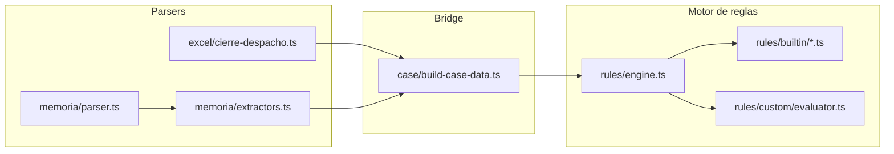

# Informe de auditoría: Checklist de validación de Memorias

**Fecha de auditoría:** 18 de junio de 2026  
**Alcance:** Motor de reglas (`src/lib/rules/builtin/`) y parsers (`src/lib/parsers/`)  
**Tipos de memoria:** Normal, Abreviada, Pyme  
**Metodología:** Cruce punto a punto del checklist definitivo contra código fuente y catálogos PGC

---

## Resumen ejecutivo

El sistema dispone de un motor de validación **100 % determinista** con **46 reglas canónicas** distribuidas en 14 módulos, más reglas custom JSON configurables por expediente. No existe integración con LLM en producción; la arquitectura (`CaseData` serializable + contrato `RuleDefinition`) está preparada para incorporarla.

| Métrica | Valor |
|---|---|
| Puntos del checklist cubiertos de forma sólida | **1** (Operaciones vinculadas) |
| Puntos parcialmente cubiertos | **6** (Estructura, Interanual, Formato, Cuadros, Calcis/Fiscal, Firmas) |
| Puntos sin implementar | **4** (PMP, Distribución, DANA, Paginación) |
| Reglas canónicas relevantes al checklist | ~35 de 46 |
| Integración LLM | Ausente (`PROYECTO_RIM_SUMMARY.md` §5) |

**Fortalezas:** el apartado de operaciones vinculadas es el más maduro (5 reglas + helper dedicado con cruces memoria↔Excel fila a fila). El flujo del libro de cierre `.xlsm` del despacho está bien integrado para balance, vinculadas e impuesto corriente.

**Debilidades críticas:** hojas ministeriales parseadas (`calcis`, `dana`, `pagos proveedores`) sin reglas asociadas; imposibilidad de validar paginación en RTF/DOCX A3SOC; memoria Normal y Pyme sin catálogo ni reglas de completitud estructural equivalentes a la abreviada.

---

## Arquitectura del flujo de validación



### Capas conceptuales del motor

| Capa | Descripción | Módulos principales |
|---|---|---|
| **Reglas duras** | Formato, estructura, identificación | `formal.ts`, `cierre.ts` (CIERRE_006–009), `temporal.ts` |
| **Consistencia numérica** | Cruce Excel ↔ memoria con tolerancias | `cross.ts`, `cierre.ts`, `balance.ts`, `fiscal*.ts` |
| **Semántica (heurística)** | Keywords + contradicción con magnitudes | `narrative-advanced.ts`, `anomaly.ts`, `temporal.ts` |

### Catálogos de referencia

| Archivo | Contenido |
|---|---|
| `data/pgc/apartados-memoria.json` | Apartados Normal (14, sin numeración), Abreviada (01–11). **Sin catálogo Pyme.** |
| `data/pgc/reglas-fiscales.json` | Keywords fiscales, tolerancias de cuadre, umbrales interanuales |

### Detección de tipo de memoria

Función `detectarTipoMemoria()` en `src/lib/parsers/memoria/extractors.ts`:

1. Texto `"memoria abreviada"` → `abreviada`
2. Texto `"memoria pymes"` → `pymes`
3. Texto `"memoria normal"` → `normal`
4. Heurística: ≤13 apartados numerados → `abreviada`
5. Default → `normal`

**Riesgo:** una memoria Pyme con pocos apartados puede clasificarse como abreviada, activando `CIERRE_006` incorrectamente.

---

## Matriz resumen del checklist

| # | Punto del checklist | Estado | Normal | Abreviada | Pyme |
|---|---|---|---|---|---|
| 1 | Estructura obligatoria + correlativa | ⚠️ Parcial | Sin regla completitud | Presencia 01–11 | Sin catálogo |
| 2 | Interanual (párrafos faltantes) | ⚠️ Parcial | 2 secciones clave | 2 secciones clave | 2 secciones clave |
| 3 | Formato | ⚠️ Parcial | Parcial | Parcial | Parcial |
| 4 | Cuadros numéricos | ⚠️ Parcial | Balance sí | Balance sí | Balance sí |
| 5 | Calcis / Fiscal | ⚠️ Parcial | Narrativa + IS | Narrativa + IS | Narrativa + IS |
| 6 | Operaciones vinculadas | ✅ Implementado | Completo | Completo | Completo |
| 7 | Ley Morosidad (PMP) | ❌ Falta | Solo extracción | Solo extracción | Solo extracción |
| 8 | Firmas | ⚠️ Parcial | Identificación sí | Identificación sí | Identificación sí |
| 9 | Distribución / Reserva cap. | ❌ Falta | No aplica regla | No aplica | No aplica |
| 10 | DANA | ❌ Falta | Hoja parseada | Hoja parseada | Hoja parseada |
| 11 | Paginación página 5 | ❌ Falta | No aplica | Sin regla | Sin regla |

---

## Detalle por punto del checklist

---

### 1. Estructura: apartados obligatorios y numeración correlativa

**Estado:** ⚠️ Parcial / Hardcodeado

#### Dónde y cómo

| Componente | Archivo | Lógica |
|---|---|---|
| Completitud abreviada 01–11 | `src/lib/rules/builtin/cierre.ts` → `CIERRE_006` | Filtra `sections` con `numero !== undefined`; compara contra catálogo `abreviada` en `apartados-memoria.json`. **Skip si `tipoMemoria !== "abreviada"`.** |
| Vinculadas obligatorias | `src/lib/rules/builtin/pgc.ts` → `PGC_001` | `findSection()` con variantes: `operaciones vinculadas`, `partes vinculadas`, etc. |
| Situación fiscal obligatoria | `src/lib/rules/builtin/pgc.ts` → `PGC_002` | `findSection()` con variantes: `situación fiscal`, `impuesto sobre sociedades`, etc. |
| Extracción de apartados | `src/lib/parsers/memoria/extractors.ts` → `extraerApartados()` | Regex canónica: `^(\d{2})\s+([A-ZÁÉÍÓÚÑ].{2,120})$`. Marca `obligatorio` cruzando catálogos normal + abreviada. |
| Apartados duplicados | `src/lib/rules/builtin/formal.ts` → `FORMAL_002` | Títulos repetidos detectados en `analizarFormal()`. |

**Catálogo abreviada** (`data/pgc/apartados-memoria.json`): apartados 1–11 incluyendo situación fiscal (08), vinculadas (09) y PMP (11).

**Catálogo normal**: 14 apartados por keywords (`actividad`, `bases_presentacion`, …, `propuesta_aplicacion`) **sin numeración** y **sin regla de completitud**.

#### Brechas / cambios necesarios

| Brecha | Impacto | Cambio propuesto | Enfoque |
|---|---|---|---|
| Numeración no correlativa | No detecta huecos (01, 03, 05) ni desorden | Nueva regla `CIERRE_010`: verificar `numeros === [1..N]` sin huecos | Determinista |
| Memoria Normal sin validación estructural | Omisiones de apartados no se detectan | Nueva regla `PGC_003`: match por variantes del catálogo `normal` | Determinista |
| Pyme sin catálogo | Tipo detectado pero sin reglas propias | Añadir catálogo `pymes` en JSON + regla equivalente a CIERRE_006 | Determinista |
| Heurística `≤13 apartados → abreviada` | Clasificación errónea Pyme/Normal | Priorizar detección explícita en portada; eliminar heurística como fallback único | Determinista |

**Viabilidad técnica:** Alta. El patrón de `CIERRE_006` es reutilizable. Esfuerzo estimado: medio.

**Recomendación LLM:** No necesario. La estructura PGC es determinista y catalogable.

---

### 2. Interanual: párrafos/apartados faltantes vs ejercicio anterior

**Estado:** ⚠️ Parcial / Hardcodeado

#### Dónde y cómo

| Regla | Archivo | Qué valida |
|---|---|---|
| `INTER_003` | `src/lib/rules/builtin/interannual.ts` | Solo 2 secciones: `vinculadas` y `fiscal`. Búsqueda por keywords en `fullText` N vs N-1. |
| `TEMP_001` | `src/lib/rules/builtin/temporal.ts` | Años obsoletos en plantilla (arrastre de ejercicios anteriores). |
| `ANOM_001` / `ANOM_002` | `src/lib/rules/builtin/anomaly.ts` | Variación >50% en resultado/activo sin narrativa explicativa. |
| `INTER_001` | `src/lib/rules/builtin/interannual.ts` | Variación numérica >30% activo/resultado (Excel, no memoria). |
| `INTER_004` | `src/lib/rules/builtin/interannual.ts` | Cuentas nuevas con saldo >5.000 €. |

**Lógica clave de `INTER_003`:**

```typescript
const KEY_SECTIONS = [
  { id: "vinculadas", keywords: ["operaciones vinculadas", "partes vinculadas"] },
  { id: "fiscal", keywords: ["situación fiscal", "impuesto sobre sociedades", "conciliación fiscal"] },
];
const desaparecidas = KEY_SECTIONS.filter(
  (sec) => sectionPresent(textoAnterior, sec.keywords) && !sectionPresent(textoActual, sec.keywords)
);
```

**Requisito:** `priorYear.memory` cargado en `CaseData` (memoria del ejercicio anterior).

#### Brechas / cambios necesarios

| Brecha | Impacto | Cambio propuesto | Enfoque |
|---|---|---|---|
| No diff de párrafos | Párrafos eliminados o no actualizados pasan desapercibidos | Fase 2: diff semántico N vs N-1 con Agente IA | **LLM** |
| Solo 2 de 11–14 secciones | Omisiones en inmovilizado, provisiones, etc. no se detectan | Fase 1: extender `INTER_003` con todos los apartados del catálogo según `tipoMemoria` | Determinista |
| Sin comparación de contenido | Apartado presente pero vacío o sin actualizar no se detecta | Fase 2: LLM comparando `sections[].contenido` entre ejercicios | **LLM** |

Documentado como hueco futuro en `PROYECTO_RIM_SUMMARY.md` (línea 196).

**Viabilidad técnica:** Fase 1 alta (medio esfuerzo). Fase 2 requiere extensión async del motor de reglas.

**Recomendación LLM:** **Candidato ideal.** Alta variabilidad redaccional; bajo riesgo si la salida es advisory (warning, no bloqueante).

---

### 3. Formato: frases cortadas, repetidas, espacios, ":" sin continuación

**Estado:** ⚠️ Parcial

#### Dónde y cómo

| Control | Estado | Archivo | Lógica / Regex |
|---|---|---|---|
| Frases cortadas / incompletas | ✅ Implementado | `formal.ts` → `FORMAL_001` | `analizarFormal()` en `extractors.ts`: párrafos 40–200 chars que terminan en `,` o palabra funcional (`de`, `del`, `la`, `los`, …) |
| Apartados duplicados (títulos) | ✅ Implementado | `formal.ts` → `FORMAL_002` | `apartadosRepetidos` — títulos repetidos, no texto en cuerpo |
| Placeholders en blanco | ⚠️ Extraído, sin regla | `extractors.ts` → `analizarFormal()` | `/\[\.{2,}\]|\[\.+\]|_{5,}|XXX|TBD|PENDIENTE DE/gi` → `camposVacios[]` |
| Texto repetido en cuerpo | ❌ Falta | — | — |
| Espacios en blanco excesivos | ❌ Falta | — | — |
| Texto terminado en ":" sin continuación | ❌ Falta | — | — |

**Detección de frases cortadas (`analizarFormal`):**

```typescript
const PALABRAS_FUNCIONALES =
  /(?:\b(?:de|del|la|las|el|los|y|o|u|e|en|a|al|que|con|para|por|su|sus|se|ni|como|según|entre|sobre|hacia|sin|tras|cuyo|cuya|es|son|ha|han|sido|más))$/i;
// Párrafos 40–200 chars, sin "|" (tablas), sin empezar por dígito
if (trimmed.length > 40 && trimmed.length < 200 && !/^\d/.test(trimmed) &&
    (/, $/.test(trimmed) || PALABRAS_FUNCIONALES.test(trimmed))) { ... }
```

#### Brechas / cambios necesarios

| Brecha | Cambio propuesto | Enfoque |
|---|---|---|
| `camposVacios` sin regla | `FORMAL_005`: fallar si `camposVacios.length > 0` | Determinista |
| ":" huérfano | `FORMAL_003`: líneas no-título que terminan en `:\s*$` sin párrafo siguiente | Determinista |
| Whitespace excesivo | `FORMAL_004`: detectar `\n{4,}` o bloques de líneas vacías consecutivas | Determinista |
| Párrafos duplicados con redacción distinta | Comparación semántica de chunks de texto | **LLM** (opcional) |

**Viabilidad técnica:** Alta para regex (bajo esfuerzo). La detección de duplicados semánticos es candidata LLM.

**Recomendación LLM:** Solo para párrafos repetidos con redacción ligeramente distinta. Los demás sub-checks son seguros en código puro.

---

### 4. Cuadros numéricos: cuadre interno, balance, columna comparativa

**Estado:** ⚠️ Parcial

#### Dónde y cómo

| Control | Estado | Regla / Función |
|---|---|---|
| Balance activo = PN + pasivo (Excel) | ✅ Implementado | `BAL_001` (`balance.ts`), `CIERRE_002` (`cierre.ts`) — tolerancia en `reglas-fiscales.json` |
| Tablas vacías en memoria | ✅ Implementado | `CIERRE_007` + `tablaEstaVacia()` |
| Tablas anunciadas sin contenido | ✅ Implementado | `detectarTablasAnunciadasAusentes()` + `CIERRE_007` |
| Cruces puntuales memoria ↔ Excel | ⚠️ Parcial | `CROSS_002` (activos financieros), `CROSS_003` (pasivo), `CROSS_005` (IS), `CIERRE_004/005` (vinculadas, impuesto) |
| Suma interna filas/columnas de tablas | ❌ Falta | — |
| Columna comparativa vs ejercicio anterior | ❌ Falta (solo parseo) | `columnasDatosRelevantes()` identifica `IMPORTE 20\d{2}` pero solo usa la última columna |
| Cruce sistemático `figures.*` vs balance | ❌ Falta | `extraerCifras()` extrae cifras pero pocas reglas las consumen |

**Regex tablas anunciadas ausentes:**

```typescript
const patronAnuncio =
  /(se detallan? a continuaci[óo]n|a continuaci[óo]n se detallan?|de los diferentes elementos es:|siguiente detalle:|se muestran? a continuaci[óo]n)/i;
```

**Parser de columnas comparativas:**

```typescript
function columnasDatosRelevantes(cabecera: string[]): number[] {
  // Busca IMPORTE 20xx; devuelve solo la última columna encontrada
  if (/IMPORTE\s+20\d{2}/i.test(cabecera[i])) importeCols.push(i);
  return [importeCols[importeCols.length - 1]];
}
```

#### Brechas / cambios necesarios

| Brecha | Cambio propuesto | Enfoque |
|---|---|---|
| Sin suma interna de tablas | `CUADRO_001`: sumar filas con fila TOTAL; validar subtotales | Determinista |
| Sin cruce cifras memoria vs balance | `CUADRO_002`: cruzar `figures.activoTotal`, `resultadoEjercicio` vs `financials.balance` | Determinista |
| Sin validación columna N-1 | `CUADRO_003`: columna comparativa vs `priorYear.memory.figures` o `balanceAnterior` | Determinista |
| Parser de tablas RTF frágil | Mejorar reconstrucción de tablas A3SOC antes de validar sumas | Parser |

**Viabilidad técnica:** Media-alta. Depende de robustez del parser de tablas. Esfuerzo: medio-alto.

**Recomendación LLM:** No para cuadres numéricos (deben ser deterministas). LLM útil solo para tablas degradadas que el parser no reconstruye.

---

### 5. Calcis / Fiscal: Situación Fiscal y conciliación vs CALCIS

**Estado:** ⚠️ Parcial / Hardcodeado

#### Dónde y cómo

| Control | Estado | Regla / Archivo |
|---|---|---|
| Apartado situación fiscal presente | ✅ Implementado | `PGC_002` (`pgc.ts`) |
| Impuesto corriente memoria vs 6300 | ✅ Implementado | `CIERRE_005` (libro cierre), `CROSS_005` (cuenta 630) |
| BIN / diferencias temporarias narradas | ✅ Implementado | `FISCAL_001/002`, `FISCAL_ADV_001/002` |
| Hoja CALCIS parseada | ✅ Datos disponibles | `cierre-despacho.ts` → `hojasMinisterio[]`; whitelist en `sheet-config.ts` |
| Conciliación resultado ↔ BI ↔ CALCIS | ❌ Falta | Ninguna regla consume `hojasMinisterio` donde `nombre === "calcis"` |

**Extracción impuesto corriente en memoria:**

```typescript
const impuesto = texto.match(
  /impuesto corriente asciende a\s+(-?[\d.,]+)(?:\s*\((-?[\d.,]+)\s+en\s+(\d{4})\))?/i
);
```

**`CIERRE_005` — cruce impuesto:**

```typescript
const { valor, fuente } = saldoCierre(libro, ["6300"]);
const impuestoExcel = Math.abs(valor);
const cuadra = Math.abs(Math.abs(impuestoMemoria) - impuestoExcel) <= 1;
```

**Hojas ministeriales parseadas** (`sheet-config.ts`): `calcis`, `dana`, `pagos proveedores`, `inmovilizado`, `ajuis`, `bonificacion`, etc. → `parseHojaMinisterio()` produce epígrafes `{ etiqueta, actual, anterior }`.

#### Brechas / cambios necesarios

| Brecha | Cambio propuesto | Enfoque |
|---|---|---|
| Sin triangulación CALCIS | `FISCAL_003`: mapear epígrafes CALCIS (resultado contable, BI, cuota líquida) y cruzar con narrativa + cuentas | Determinista |
| Sin cruce epígrafes vs memoria | Reutilizar patrón `cruzarVinculadas()` de `cierre.ts` para filas del apartado 08 | Determinista |
| Layout CALCIS no documentado | Catalogar epígrafes fijos de la hoja del despacho antes de implementar | Documentación |

**Viabilidad técnica:** Media-alta. Requiere mapeo de epígrafes CALCIS del layout A3SOC. Esfuerzo: medio-alto.

**Recomendación LLM:** No para cuadres numéricos CALCIS. LLM opcional para verificar que la narrativa del apartado 08 describe correctamente las partidas de la conciliación.

---

### 6. Operaciones vinculadas: completitud y corrección

**Estado:** ✅ Implementado

#### Dónde y cómo

| Regla | Archivo | Función |
|---|---|---|
| `PGC_001` | `pgc.ts` | Apartado obligatorio por keywords |
| `CROSS_001` | `cross.ts` | Totales Excel vs memoria; afirmación de ausencia contradicha |
| `CIERRE_004` | `cierre.ts` | Cruce fila a fila tablas apartado 09 vs cuentas contables |
| `CONSISTENCIA_GLOBAL_001` | `consistency-global.ts` | Saldos altos sin narrativa vinculadas |
| `NARR_ADV_001` | `narrative-advanced.ts` | Patrón "sin operaciones vinculadas" contradicho por balance |

**Helper principal** — `src/lib/rules/helpers/vinculadas.ts`:

- `computeVinculadasTotals()` — suma Excel (cuentas 24/25/552/242/43/40) vs tablas apartado 09
- `diagnoseVinculadasMismatch()` — umbrales `10_000 €` y `5%`
- `buildVinculadasExcelBreakdown()` — desglose por categoría
- `resolveVinculadasMemoryContext()` — contexto de página y apartado

**Regex en tablas vinculadas:**

```typescript
clientesGrupo: sumTableByPattern(data, /clientes?.*(grupo|vinculad|dependiente)/i),
proveedoresGrupo: sumTableByPattern(data, /proveedores?.*(grupo|vinculad|dependiente)/i),
```

**Mapeo fila a fila (`CIERRE_004`):**

```typescript
const MAPEO_VINCULADAS = [
  { patron: /inversiones financieras a largo plazo/i, prefijos: ["2423", "2424"] },
  { patron: /inversiones financieras a corto plazo/i, prefijos: ["5323", "5324", "5343", "5344"] },
  { patron: /clientes por ventas.*corto/i, prefijos: ["433", "434"] },
  { patron: /^a\)\s*proveedores/i, prefijos: ["403", "404"] },
];
```

#### Brechas menores

| Brecha | Impacto | Recomendación |
|---|---|---|
| Completitud cualitativa (descripción de cada operación) | No verificada | LLM opcional, prioridad baja |
| Dependencia del parser de tablas apartado 09 | Cruces fallan si tabla no se parsea | Endurecer tests con expedientes reales |

**Viabilidad técnica:** Ya operativa. Mantener y reforzar con tests.

**Recomendación LLM:** Solo para validar narrativa cualitativa incompleta. Los cuadres numéricos deben seguir siendo deterministas.

---

### 7. Ley de Morosidad (PMP): periodo medio de pago dentro del plazo legal

**Estado:** ❌ Falta

#### Dónde y cómo (solo extracción)

| Componente | Archivo | Detalle |
|---|---|---|
| Extracción PMP | `extractors.ts` → `extraerDatosClave()` | Regex: `/Periodo medio de pago a proveedores\s*\|\s*([\d.,]+)\s*(?:\|\s*([\d.,]+))?/i` |
| Campos en dominio | `src/types/domain.ts` | `pmpDias`, `pmpDiasAnterior` en `DatosClaveMemoria` |
| Apartado 11 en catálogo | `apartados-memoria.json` | Cubierto por `CIERRE_006` (presencia, no valor) |
| Hoja Excel | `sheet-config.ts` | `"pagos proveedores"` en whitelist — parseada como `hojasMinisterio`, sin regla |

**No existe ninguna regla** que valide `pmpDias > 60` (art. 3 Ley 15/2010) ni cruce memoria vs hoja Excel.

#### Brechas / cambios necesarios

| Cambio propuesto | Enfoque | Esfuerzo |
|---|---|---|
| Regla `MOROSIDAD_001`: `pmpDias > 60` → warning/error | Determinista | Bajo |
| Cruce `pmpDias` vs epígrafes hoja `pagos proveedores` | Determinista | Bajo |
| Regla custom JSON alternativa si `pmpDias` está en contexto de evaluación | Determinista | Trivial |

**Viabilidad técnica:** Muy alta. Los datos ya se extraen; solo falta la regla.

**Recomendación LLM:** No necesario. Validación numérica binaria (≤60 días).

---

### 8. Firmas: datos de firmantes no en blanco

**Estado:** ⚠️ Parcial (cerca de ✅ Implementado)

#### Dónde y cómo

| Control | Regla / Función | Detalle |
|---|---|---|
| NIF, denominación, firma, firmante | `CIERRE_009` (`cierre.ts`) | Falla si falta cualquiera de: `kd.nif`, `kd.denominacion`, `formal.tieneFirma`, `kd.firmante` |
| Fecha de formulación | `TEMP_004` (`temporal.ts`) | Valida presencia y coherencia temporal |
| Detección bloque firma | `analizarFormal().tieneFirma` | Regex múltiples patrones A3SOC |
| Extracción firmante | `extraerDatosClave()` | `/([A-ZÁÉÍÓÚÑ][A-ZÁÉÍÓÚÑ\s]{4,60})\s+con\s+N\.?I\.?F\.?/` |
| Placeholders en blanco | `camposVacios` en `analizarFormal()` | **Detectado pero sin regla** |

**`CIERRE_009`:**

```typescript
if (!kd.nif) faltantes.push("NIF");
if (!kd.denominacion) faltantes.push("denominación social");
if (!data.memory.formal.tieneFirma) faltantes.push("bloque de firma");
if (!kd.firmante) faltantes.push("identificación del firmante");
```

**Detección de firma:**

```typescript
const tieneFirma =
  /quedan formuladas las cuentas anuales|dando su conformidad mediante firma|firmado por/i.test(textoLower) ||
  (/firma|administrador|consejero|apoderado|representante\s+legal/i.test(textoLower) &&
    /[_]{3,}|\.{3,}|firmado/i.test(textoLower));
```

#### Brechas / cambios necesarios

| Brecha | Cambio propuesto | Enfoque |
|---|---|---|
| `camposVacios` sin regla | `FORMAL_005`: fallar si hay placeholders (`___`, `XXX`, `TBD`) | Determinista |
| Regex firmante frágil | Ampliar patrones para formatos no A3SOC | Determinista |
| Validación de bloque firma en formatos no estándar | Agente IA con contexto del final del documento | **LLM** (opcional) |

**Viabilidad técnica:** Alta para placeholders (bajo esfuerzo). Regex firmante mejorable sin LLM.

**Recomendación LLM:** Opcional solo para formatos de firma no estándar.

---

### 9. Distribución de Resultados / Reserva de Capitalización (solo Normal)

**Estado:** ❌ Falta

#### Dónde y cómo (infraestructura mínima)

| Componente | Archivo | Detalle |
|---|---|---|
| Catálogo apartado | `apartados-memoria.json` | `propuesta_aplicacion` / "distribución del resultado" en catálogo `normal` |
| Extracción reservas | `extractors.ts` → `extraerCifras()` | `/reservas[:\s]+([\d.,]+)/i` |
| Mención tangencial dividendos | `company-type.ts` → `TIPO_HOLD_002` | Dividendos vs participaciones — no distribución de resultados |

**No existe regla** que valide:
- Presencia del apartado de propuesta de aplicación del resultado
- Que la suma de aplicaciones (reservas, dividendos, etc.) = resultado del ejercicio
- Reserva de capitalización indisponible (Ley 27/2014, art. 25 LIS)

#### Brechas / cambios necesarios

| Cambio propuesto | Enfoque | Esfuerzo |
|---|---|---|
| `DIST_001` (solo `tipoMemoria === "normal"`): presencia apartado + suma aplicación = resultado | Determinista | Medio |
| Cruce cuenta 1146 / reserva capitalización vs PyG | Determinista | Medio |
| Validar redacción legal de indisponibilidad | **LLM** | Bajo (prioridad baja) |

**Viabilidad técnica:** Media. Requiere parser de tabla de distribución en memoria Normal.

**Recomendación LLM:** Solo para validar redacción legal de indisponibilidad. Los cuadres deben ser deterministas.

---

### 10. DANA: información exigida por la norma excepcional

**Estado:** ❌ Falta

#### Dónde y cómo (solo infraestructura de parseo)

| Componente | Archivo | Detalle |
|---|---|---|
| Hoja Excel `dana` | `sheet-config.ts` | En whitelist `HOJAS_LIBRO_CIERRE` |
| Parseo | `cierre-despacho.ts` → `parseHojaMinisterio()` | Epígrafes comparativos en `libroCierre.hojasMinisterio[]` |
| Ejemplos en repositorio | `examples/M0106733.DOC` | Texto DANA en memorias reales |
| Keywords fiscales | `reglas-fiscales.json` | Sin keywords DANA |
| Reglas | — | **Ninguna** |

#### Brechas / cambios necesarios

| Fase | Cambio propuesto | Enfoque |
|---|---|---|
| Fase 1 | `DANA_001`: si hoja Excel `dana` tiene epígrafes con importe > 0, exigir mención en memoria (keywords + apartado fiscal) | Determinista |
| Fase 2 | Verificar que el contenido normativo exigido está presente cuando aplica | **LLM** |

**Viabilidad técnica:** Fase 1 alta (medio esfuerzo). Fase 2 requiere LLM o catálogo exhaustivo de requisitos normativos.

**Recomendación LLM:** Fase 2 — candidato ideal para verificar cumplimiento normativo del texto cuando la hoja CALCIS/DANA tiene datos.

---

### 11. Paginación: memoria empieza en página 5 (Abreviada y Pyme)

**Estado:** ❌ Falta

#### Dónde y cómo (utilidades sin regla)

| Utilidad | Archivo | Limitación |
|---|---|---|
| `contarPaginasPdf()` | `extractors.ts` | Cuenta `\f` — fiable solo en PDF |
| `lineaToPagina()` | `extractors.ts` | Estima página por saltos de formulario en texto |
| Estimación Word/RTF | `parser.ts` | `paginas = Math.ceil(texto.length / 3000)` — **no fiable** |
| RTF descarta pies | `rtf.ts` línea 25 | `// Los pies se descartan (numeración de página).` |

**No existe regla** que verifique que el primer apartado de la memoria (`01` o `MEMORIA`) aparece en la página 5 para abreviada/pyme.

#### Brechas / cambios necesarios

| Plazo | Cambio propuesto | Fiabilidad |
|---|---|---|
| Corto plazo | Regla solo para PDF con `\f` reales: detectar página del primer `01` / `MEMORIA` | Media (solo PDF) |
| Medio plazo | Preservar pies de página en parser RTF o metadata DOCX | Alta |
| No recomendado | Heurística `length/3000` para decisiones bloqueantes | Baja |

**Viabilidad técnica:** Baja en corto plazo (formato predominante del despacho es RTF/DOC A3SOC). Media-alta tras mejora del parser.

**Recomendación LLM:** No aplicable. Es un problema de extracción de metadata del documento, no de comprensión semántica.

---

## Cobertura por tipo de memoria

| Punto | Normal | Abreviada | Pyme |
|---|---|---|---|
| 1 Estructura | `PGC_001/002` solo keywords; sin completitud 14 apartados | `CIERRE_006` (01–11) + `PGC_001/002` | Detectado pero sin catálogo ni regla |
| 2 Interanual | `INTER_003` (2 secciones) si hay N-1 | Igual | Igual |
| 3 Formato | `FORMAL_001/002` | Igual | Igual |
| 4 Cuadros | `BAL_001`, `CROSS_*`, `CIERRE_002/007` | Igual | Igual |
| 5 Calcis/Fiscal | `PGC_002`, `FISCAL_*`, `CIERRE_005` | Igual | Igual |
| 6 Vinculadas | Completo | Completo | Completo |
| 7 PMP | No aplica apartado 11 | Extracción sin regla | Extracción sin regla |
| 8 Firmas | `CIERRE_009`, `TEMP_004` | Igual | Igual |
| 9 Distribución | Catálogo sí, regla no | No aplica (checklist) | No aplica |
| 10 DANA | Condicional según hoja Excel | Igual | Igual |
| 11 Paginación pág. 5 | No aplica (checklist) | Sin regla | Sin regla |

---

## Inventario de reglas → checklist

| ID Regla | Módulo | Punto checklist |
|---|---|---|
| `CIERRE_006` | cierre.ts | 1 (estructura abreviada) |
| `PGC_001` | pgc.ts | 1, 6 |
| `PGC_002` | pgc.ts | 1, 5 |
| `FORMAL_001` | formal.ts | 3 |
| `FORMAL_002` | formal.ts | 1, 3 |
| `INTER_003` | interannual.ts | 2 |
| `TEMP_001` | temporal.ts | 2 |
| `ANOM_001/002` | anomaly.ts | 2 |
| `INTER_001` | interannual.ts | 2, 4 |
| `BAL_001` | balance.ts | 4 |
| `CIERRE_002` | cierre.ts | 4 |
| `CIERRE_007` | cierre.ts | 3, 4 |
| `CROSS_002–005` | cross.ts | 4, 5 |
| `CIERRE_004/005` | cierre.ts | 4, 5, 6 |
| `FISCAL_001/002` | fiscal.ts | 5 |
| `FISCAL_ADV_001/002` | fiscal-advanced.ts | 5 |
| `CROSS_001` | cross.ts | 6 |
| `CONSISTENCIA_GLOBAL_001` | consistency-global.ts | 6 |
| `NARR_ADV_001` | narrative-advanced.ts | 6 |
| `CIERRE_009` | cierre.ts | 8 |
| `TEMP_004` | temporal.ts | 8 |
| *(ausente)* | — | 7, 9, 10, 11 |

---

## Roadmap de implementación priorizado

Priorización orientada a **estabilidad del sistema**: reglas deterministas de bajo riesgo primero; LLM solo donde las heurísticas son insuficientes y el impacto de falsos positivos es bajo (advisory).

| Prioridad | Item checklist | Regla propuesta | Enfoque | Esfuerzo | Riesgo |
|---|---|---|---|---|---|
| **P0** | 7 PMP | `MOROSIDAD_001` | `pmpDias > 60` + cruce hoja Excel | Bajo | Bajo |
| **P0** | 8 Firmas | `FORMAL_005` | Activar regla sobre `camposVacios` ya extraídos | Bajo | Bajo |
| **P1** | 1 Estructura | `CIERRE_010` + `PGC_003` | Correlatividad + completitud Normal | Medio | Bajo |
| **P1** | 5 CALCIS | `FISCAL_003` | Mapeo epígrafes CALCIS vs memoria | Medio-Alto | Medio |
| **P1** | 4 Cuadros | `CUADRO_001–003` | Sumas internas + cruce figures + comparativa | Medio-Alto | Medio |
| **P2** | 2 Interanual | Extensión `INTER_003` + LLM | Apartados completos + diff semántico | Alto | Medio (LLM advisory) |
| **P2** | 10 DANA | `DANA_001` | Condicional hoja Excel → keywords memoria | Medio | Bajo |
| **P2** | 9 Distribución | `DIST_001` | Solo Normal: aplicación = resultado | Medio | Medio |
| **P3** | 11 Paginación | Mejora parser RTF + regla PDF | Preservar numeración en pies | Alto | Alto |
| **P3** | 3 Formato | `FORMAL_003/004` | `:` huérfano + whitespace excesivo | Bajo-Medio | Bajo |

---

## Matriz LLM vs determinista

| Punto | Determinista (recomendado) | LLM (candidato) | No usar LLM |
|---|---|---|---|
| 1 Estructura | ✅ Catálogo + correlatividad | — | — |
| 2 Interanual | ✅ Presencia apartados N vs N-1 | ✅ Diff semántico párrafos | — |
| 3 Formato | ✅ Regex (`:`, whitespace, placeholders) | ⚠️ Párrafos duplicados con redacción distinta | — |
| 4 Cuadros | ✅ Sumas, cruces, tolerancias | ⚠️ Tablas degradadas no parseables | ❌ Cuadres numéricos |
| 5 CALCIS | ✅ Epígrafes CALCIS vs cifras | ⚠️ Coherencia narrativa conciliación | ❌ Triangulación numérica |
| 6 Vinculadas | ✅ Ya implementado | ⚠️ Completitud cualitativa | ❌ Cruces numéricos |
| 7 PMP | ✅ Umbral 60 días | — | — |
| 8 Firmas | ✅ Placeholders + regex | ⚠️ Formatos no A3SOC | — |
| 9 Distribución | ✅ Suma aplicación = resultado | ⚠️ Redacción indisponibilidad | ❌ Cuadre numérico |
| 10 DANA | ✅ Trigger condicional hoja Excel | ✅ Contenido normativo exigido | — |
| 11 Paginación | ✅ Metadata documento (parser) | — | ❌ Estimación heurística |

**Criterio de decisión:** usar LLM solo cuando (a) la variabilidad del input impide reglas fijas, (b) el coste de falsos positivos es aceptable con severidad `warning`, y (c) existe fallback determinista para los casos parseables.

---

## Riesgos técnicos transversales

| Riesgo | Impacto en checklist | Mitigación |
|---|---|---|
| Parser RTF descarta numeración de página (`rtf.ts`) | Bloquea punto 11 | Preservar pies; priorizar PDF para validación paginación |
| `libroCierre.a3soc[]` siempre vacío | `CIERRE_003` inoperante; cruces usan SYS como fallback | Poblar A3SOC o deprecar regla |
| `libroCierre.notas[]` siempre vacío | `CIERRE_008` inoperante | Parsear hojas PENDIENTES/INCIDENCIAS |
| Heurística Pyme → abreviada | `CIERRE_006` se aplica incorrectamente | Catálogo `pymes` + detección explícita |
| `hojasMinisterio` sin reglas | Puntos 5, 7, 10 sin validar | Implementar consumo en reglas nuevas |
| Motor de reglas síncrono | Impide reglas LLM async | Extender `execute` a `Promise<RuleOutcome>` |
| Parser tablas RTF frágil | Puntos 4, 6, 9 dependen de tablas bien parseadas | Tests con expedientes reales del despacho |

---

## Conclusión

El motor actual cubre de forma **sólida** el cruce numérico de operaciones vinculadas y dispone de bases para fiscal (situación fiscal, impuesto corriente, BIN/DT). Sin embargo, **5 de 11 puntos del checklist carecen de regla** (PMP, distribución, DANA, paginación y correlatividad estructural completa), y **6 puntos están parcialmente cubiertos** con brechas identificables.

La estrategia recomendada para maximizar estabilidad:

1. **Quick wins (P0):** `MOROSIDAD_001` y `FORMAL_005` — datos ya extraídos, reglas triviales.
2. **Consolidación (P1):** estructura Normal, CALCIS y cuadros numéricos — extensión del patrón existente en `cierre.ts` y `cross.ts`.
3. **Capa semántica (P2):** interanual y DANA — primera integración LLM advisory sobre `CaseData` ya serializado.
4. **Infraestructura (P3):** parser RTF con paginación y reglas de formato avanzado.

La arquitectura (`CaseData` + `RuleDefinition` + catálogos JSON) está preparada para este roadmap sin rediseño del motor.

---

*Informe generado por auditoría de código — repositorio `memorias`, junio 2026.*
